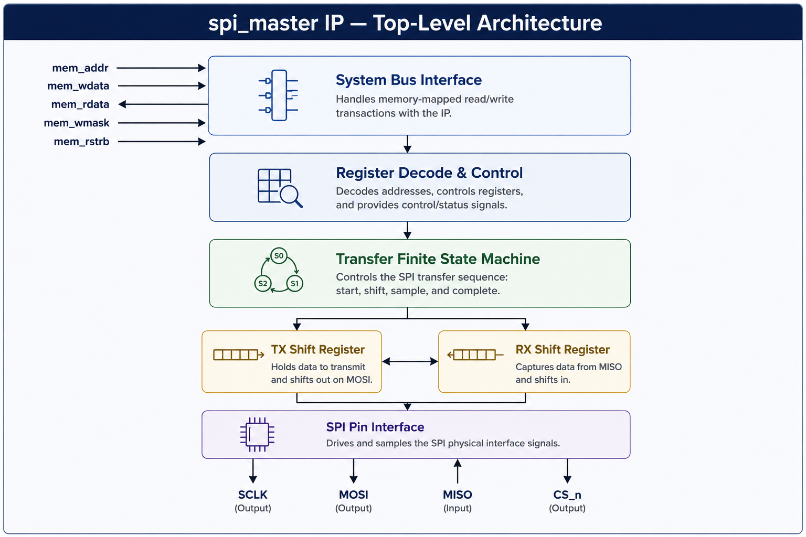
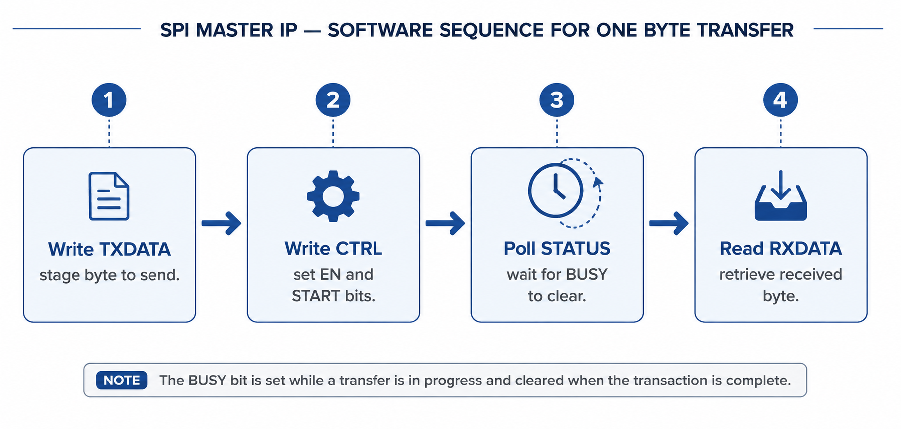

# SPI Master IP — User Guide

**IP Name:** `spi_master`
**Version:** 1.0.0
**Target Platform:** VSDSquadron FM (Lattice iCE40UP5K)
**Interface Type:** Memory-Mapped Peripheral (RV32I system bus)
**License:** See top-level `README.md`

> **Audience note:** This guide assumes you have never read a single line of the IP's RTL. Everything you need to *use* the IP — what it does, how it behaves, and what it will and will not do for you — is documented here. Internal implementation details (FSM encoding, shift-register structure, clock-divider architecture) are intentionally omitted; they are irrelevant to correct usage and are not part of this IP's supported interface.

---

## 1. IP Overview

### What is this IP?

`spi_master` is a lightweight, memory-mapped **SPI Master controller** designed for integration into RV32I-based SoCs running on the VSDSquadron FM FPGA board. It allows firmware to perform standard SPI Mode-0 byte transfers using simple register reads and writes — no bit-banging, no manual clock generation, no external SPI driver library required.

The IP exposes itself to software exactly the way a RAM location would: a fixed base address, a handful of 32-bit registers, and ordinary `load`/`store` instructions. Software does not need to know anything about SPI clock generation, chip-select timing, or shift-register mechanics — the hardware handles all of that once configured.

### Typical Use Cases

- Communicating with SPI-attached sensors (accelerometers, gyroscopes, temperature/pressure sensors)
- Driving SPI-based displays (small OLED/TFT controllers)
- Interfacing with SPI EEPROMs or external SPI flash devices
- Communicating with SPI-based ADCs/DACs
- Any point-to-point, synchronous, full-duplex serial link where a small number of pins is a hard constraint

### Why / When to Use This IP

Choose `spi_master` when your design needs a **simple, low-overhead, single-slave SPI link** and does not require high sustained throughput, multiple simultaneous chip selects, or interrupt-driven operation. Its minimal register set and single-cycle bus behavior make it easy to integrate into a small SoC without consuming significant FPGA fabric or design-review effort.

Do **not** choose this IP if your application requires FIFO buffering, DMA-driven transfers, multiple SPI modes, or multi-slave chip-select arbitration — see [Section 10, Known Limitations](#10-known-limitations--notes) before committing to this IP for such applications.

---

## 2. Feature Summary

| Category | Specification |
|---|---|
| **SPI Mode** | Mode-0 only (CPOL = 0, CPHA = 0) |
| **Transfer Width** | 8 bits (1 byte) per transaction |
| **Duplex** | Full-duplex (simultaneous transmit and receive) |
| **Chip Select** | Single, active-low (`cs_n`), automatically framed per transfer |
| **Bus Interface** | Memory-mapped, 32-bit word-aligned registers |
| **Bus Timing** | Single-cycle register access (no wait states) |
| **Clock Source** | Derived from host SoC system clock (12 MHz reference on VSDSquadron FM) |
| **Status Reporting** | `BUSY` and `DONE` flags, software-polled |
| **Interrupt Support** | Not supported in this version |
| **FIFO / Burst Support** | Not supported — one byte per transaction |
| **Multiple Chip Selects** | Not supported — single slave only |
| **DMA Support** | Not supported |

> **Note:** This IP is intentionally minimal by design. It targets applications where a small footprint and simple firmware model outweigh the need for high-throughput or multi-slave capability. See [Section 10](#10-known-limitations--notes) for a complete list of unsupported features and the recommended workaround for each.

---

## 3. Block Diagram

```
                 ┌───────────────────────────────────────────┐
                 │                RV32I SoC Bus               │
                 │   mem_addr / mem_wdata / mem_wmask /        │
                 │   mem_rstrb / mem_rdata                     │
                 └───────────────────┬─────────────────────────┘
                                     │
                          ┌──────────▼──────────┐
                          │   Register Decode    │
                          │  (address → CTRL /   │
                          │  TXDATA / RXDATA /    │
                          │  STATUS select)       │
                          └──────────┬──────────┘
                                     │
                          ┌──────────▼──────────┐
                          │   Transfer FSM        │
                          │  (IDLE → LOAD →       │
                          │   SHIFT → DONE)        │
                          └────┬────────────┬─────┘
                               │            │
                    ┌──────────▼───┐   ┌────▼──────────┐
                    │ TX Shift Reg │   │ RX Shift Reg   │
                    └──────────┬───┘   └────▲──────────┘
                               │            │
                          ┌────▼────────────┴────┐
                          │   SPI Pin Interface    │
                          │  SCLK / MOSI / MISO /  │
                          │        CS_n            │
                          └────────────────────────┘
```

**Figure 1: SPI Master IP Top-Level Block Diagram**
<p align="center">
  
</p>

---

## 4. Software Programming Model (Overview)

At the highest level, using this IP from software follows a fixed three-step pattern:

1. **Load** the byte to be transmitted into `TXDATA`.
2. **Trigger** the transfer by writing the `EN` and `START` bits into `CTRL`.
3. **Poll** `STATUS.BUSY` until it clears, then read the received byte from `RXDATA`.

```
 ┌────────────┐     ┌────────────┐     ┌────────────┐     ┌────────────┐
 │  Write      │     │  Write      │     │  Poll       │     │  Read       │
 │  TXDATA     │ --> │  CTRL       │ --> │  STATUS     │ --> │  RXDATA     │
 │ (stage byte)│     │ (EN+START)  │     │ (wait BUSY) │     │ (result)    │
 └────────────┘     └────────────┘     └────────────┘     └────────────┘
```

**Figure 2: Software Transaction Flow**
<p align="center">
  
</p>

This IP uses a **polling-based** programming model rather than interrupts. This is a deliberate design choice appropriate for single-slave, low-frequency transfer scenarios where the CPU has no other critical work to perform during the (microsecond-scale) duration of a transfer. Full register-level behavior, including exact bit positions and reset values, is documented in **`Register_Map.md`**. A complete, ready-to-compile firmware example is provided in **`Example_Usage.md`**.

---

## 5. Validation & Expected Output

This IP has been verified across three independent stages before release: RTL simulation, waveform-level timing inspection, and live hardware execution on a physical VSDSquadron FM board.

### What a Correctly Integrated System Should Do

When the example firmware (see `Example_Usage.md`) is run on a system with this IP correctly integrated:

- The firmware transmits a fixed sequence of test bytes over SPI.
- Because most bring-up configurations loop `MISO` back to `MOSI` at the board level (in the absence of an external SPI slave device), the byte received back in `RXDATA` after each transfer will be **identical** to the byte just transmitted.
- Each received byte is printed to the UART console (9600 baud, 8N1) as it is read back.

**Expected UART output** for the reference test sequence (`0xA5, 0x3C, 0xFF, 0x00, 0xB7`):

```
A5
3C
FF
00
B7
```

### Common Failure Symptoms

| Symptom | Likely Cause |
|---|---|
| No UART output at all | UART not wired/configured correctly, or firmware not reaching the SPI test routine — check integration in `Integration_Guide.md` |
| Firmware hangs (no output after first byte) | `STATUS.BUSY` never clears — check that `spi_sel`/`we` gating matches the expectations in `Integration_Guide.md` |
| Received byte does not match transmitted byte | MISO/MOSI loopback not connected (if using loopback test mode), or an actual SPI slave is attached but not responding correctly |
| Garbage / repeated bytes on UART | Address decode overlap with another peripheral — verify the SPI base address region does not alias with an existing peripheral's address range |

> **Note:** For visual confirmation on real hardware, a lit "power" LED and an active status LED near the FTDI/UART bridge chip indicate the board is powered and streaming UART data, respectively. These are coarse hardware-health indicators, not substitutes for checking actual UART byte content.

---

## 6. Known Limitations & Notes

Commercial IP documentation is expected to be explicit about what an IP does **not** do. The following limitations are permanent characteristics of this version of the IP, not bugs:

- **No interrupt support.** Software must poll `STATUS.BUSY`/`STATUS.DONE`. There is no interrupt output signal from this IP in this version.
- **Single chip-select only.** This IP drives exactly one `cs_n` line and cannot address multiple SPI slaves without external multiplexing logic.
- **No FIFO buffering.** Only one byte may be in flight at a time; `TXDATA` must not be rewritten while a transfer is in progress (writes during an active transfer are ignored — see `Register_Map.md`).
- **Fixed transfer width.** Only 8-bit transfers are supported; there is no provision for 16-bit or 32-bit SPI words.
- **Mode-0 only.** CPOL/CPHA are fixed in hardware; this IP cannot communicate with slaves that require Mode 1, 2, or 3 timing.
- **No DMA support.** All data movement between `TXDATA`/`RXDATA` and system memory must be performed explicitly by CPU instructions.
- **Assumes a system clock of 12 MHz** (as provided by the VSDSquadron FM's internal `SB_HFOSC`-derived clock). Using this IP with a different system clock frequency will change the effective SCLK frequency; see `Integration_Guide.md` for clock-dependency notes.

These limitations define the boundary of this IP's intended use case: simple, low-throughput, single-slave SPI communication. Refer to the **Future Improvements** notes in `README.md` for the direction of planned future versions.

---

*Continue to `Register_Map.md` for the full bit-level register specification, `Integration_Guide.md` for RTL integration instructions, or `Example_Usage.md` for ready-to-run firmware.*
