# RISC-V FPGA IP Development Internship

> Documentation and lab work completed as part of the **VSD FPGA Internship Screening Program**, covering RISC-V toolchain setup, compilation flow, object dump analysis, and learning outcomes.


---

## Task 1 - RISC-V Toolchain Setup

* GitHub repository setup
* RISC-V toolchain installation and verification
* Native & cross compilation
* Object dump generation and assembly analysis

## Task 2 - SPIKE Simulation & Optimization

**Part 1**

* SPIKE simulation and optimization analysis
* Assembly inspection and instruction count comparison

**Part 2**

* Multi-Floor Elevator Control System implementation
* Performance evaluation using SPIKE simulation

## Task 3 - Firmware Development & Execution

* GitHub Codespaces and local environment setup
* Custom RISC-V firmware development
* Firmware compilation, simulation, and verification

## Task 4 - GPIO Integration

* GPIO peripheral design and SoC integration
* Memory-mapped I/O implementation
* Firmware development and RTL verification

## Task 5 - Multi-Register GPIO Controller

* Multi-register GPIO IP design
* SoC integration and address decoding
* Software validation and simulation
* Documentation and verification

## Task 6 - SPI Master IP Development

* SPI protocol understanding and IP design
* RTL implementation of a memory-mapped SPI Master
* Integration with the RISC-V SoC
* Firmware development for SPI communication
* Functional simulation and waveform analysis
* FPGA hardware validation using the VSDSquadron FM board

## Task 7 - Commercial-Grade IP Documentation & Release

* SPI protocol understanding and IP architecture design
* RTL implementation of a memory-mapped SPI Master
* Integration with the RISC-V SoC

---

<details>
<summary><b>Task 1 : RISC-V Toolchain Setup and Compilation</b></summary>

<br>

## Aim

To install and verify the RISC-V GCC toolchain, compile a C program using both native GCC and RISC-V GCC, and generate the corresponding RISC-V object dump.

---

## Chip Modelling Flow

The objective of the task follows the verification methodology shown below:

- O0 = Output generated by GCC compiled executable
- O1 = Output generated by the specification C model

### Verification Condition

```text
O0 = O1
```

This ensures that the implementation matches the expected behavior defined by the specification model.

### Figure 1: Chip Modelling Verification Flow

<p align="center">
  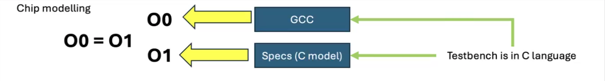
</p>

---

## Program Used

### sum_1_to_n.c

```c
#include <stdio.h>

int main()
{
    int i, sum = 0, n = 5;

    for(i = 1; i <= n; i++)
        sum = sum + i;

    printf("Sum from 1 to %d is %d\n", n, sum);

    return 0;
}
```

---

## Step 1: Program Creation

The source file was created and edited using Leafpad.

Command:

```bash
leafpad sum_1_to_n.c
```

### Figure 2: Installation and Launch of Leafpad

<p align="center">
  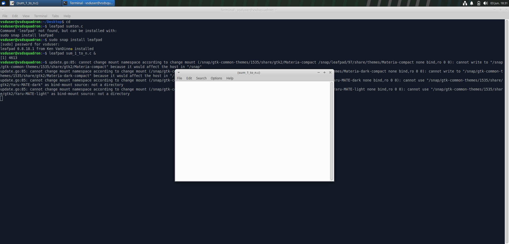
</p>

---

## Step 2: Native GCC Compilation

The C program was compiled using the native GCC compiler.

Command:

```bash
gcc sum_1_to_n.c
```

Execution:

```bash
./a.out
```

Output:

```text
Sum from 1 to 5 is 15
```

### Figure 3: Creation and Execution of C Program

<p align="center">
  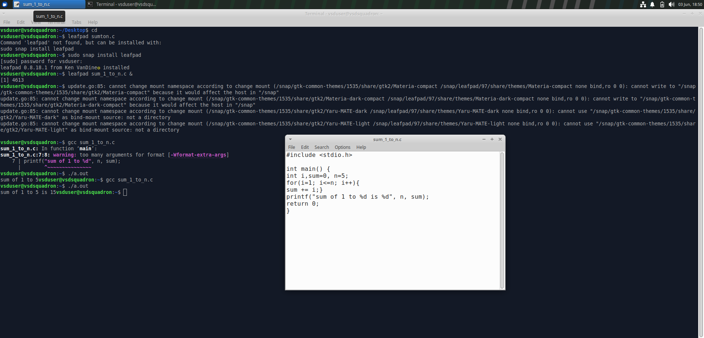
</p>

---

## Step 3: Display Source Code

The source file contents were verified using the cat command.

Command:

```bash
cat sum_1_to_n.c
```

### Figure 4: Source Code Verification

<p align="center">
  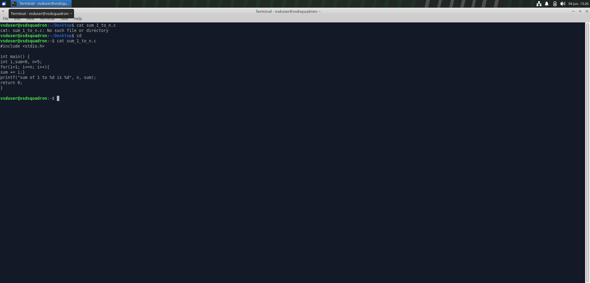
</p>

---

## Step 4: RISC-V Compilation (-O1)

The program was cross-compiled using the RISC-V GCC compiler.

Command:

```bash
riscv64-unknown-elf-gcc -O1 -mabi=lp64 -march=rv64i -o sum_1_to_n.o sum_1_to_n.c
```

### Figure 5: Navigation to RISC-V Workspace

<p align="center">
  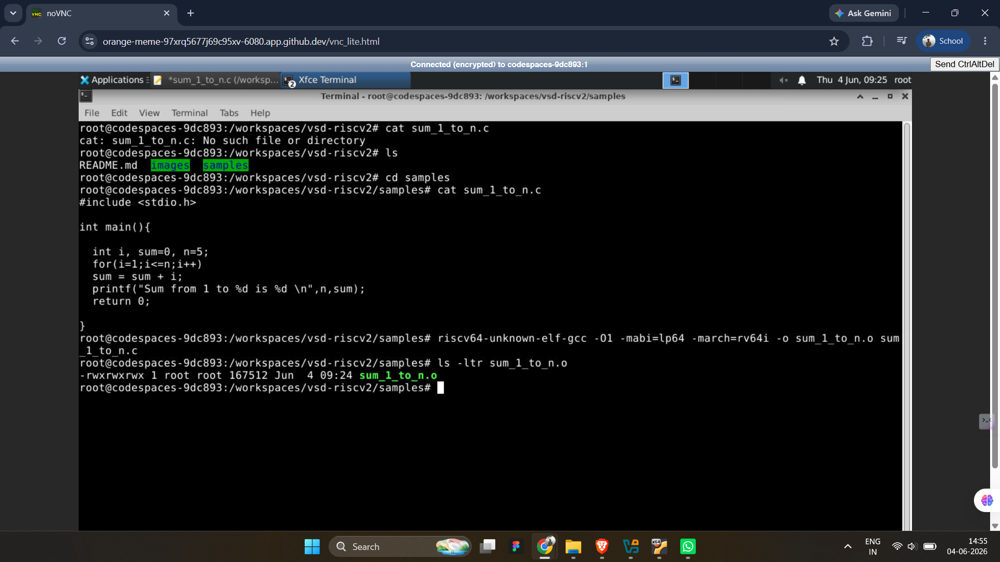
</p>

Explanation:

* O1 : Optimization Level 1
* mabi=lp64 : 64-bit ABI
* march=rv64i : RV64I instruction set architecture

---

## Step 5: Verify Generated Binary

The generated RISC-V executable file was verified.

Command:

```bash
ls -ltr sum_1_to_n.o
```

---

## Step 6: Generate RISC-V Object Dump

Command:

```bash
riscv64-unknown-elf-objdump -d sum_1_to_n.o
```

The generated assembly instructions were analyzed.

### Figure 6: Generated Binary Verification

<p align="center">
  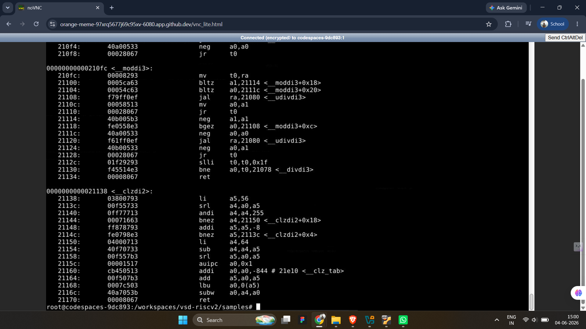
</p>

---

## Step 7: View Objdump Using Less

Command:

```bash
riscv64-unknown-elf-objdump -d sum_1_to_n.o | less
```

This enabled easier navigation through the generated assembly code.

### Figure 7: Main Function Assembly Analysis for -O1

<p align="center">
  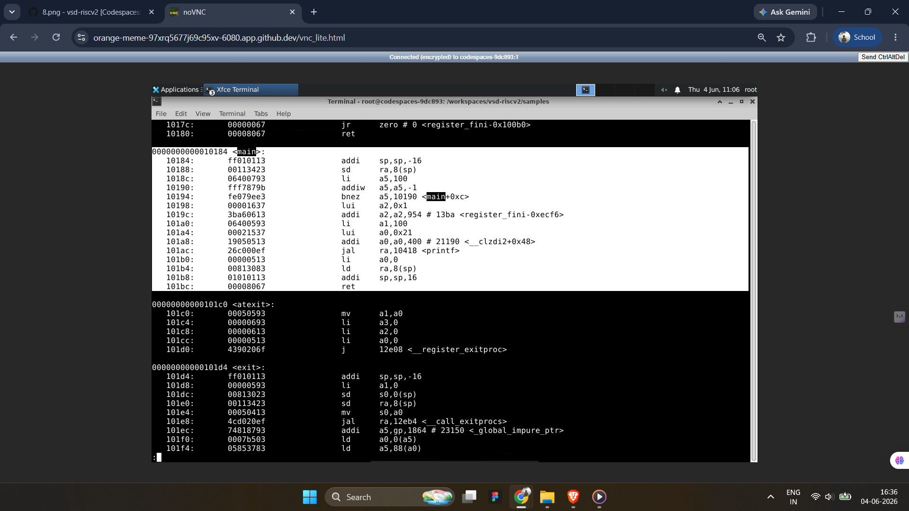
</p>

---

## Step 8: Compilation Using -Ofast Optimization

The same program was compiled using a higher optimization level.

Command:

```bash
riscv64-unknown-elf-gcc -Ofast -mabi=lp64 -march=rv64i -o sum_1_to_n.o sum_1_to_n.c
```

### Figure 8: RISC-V Compilation with Different Optimization Levels

<p align="center">
  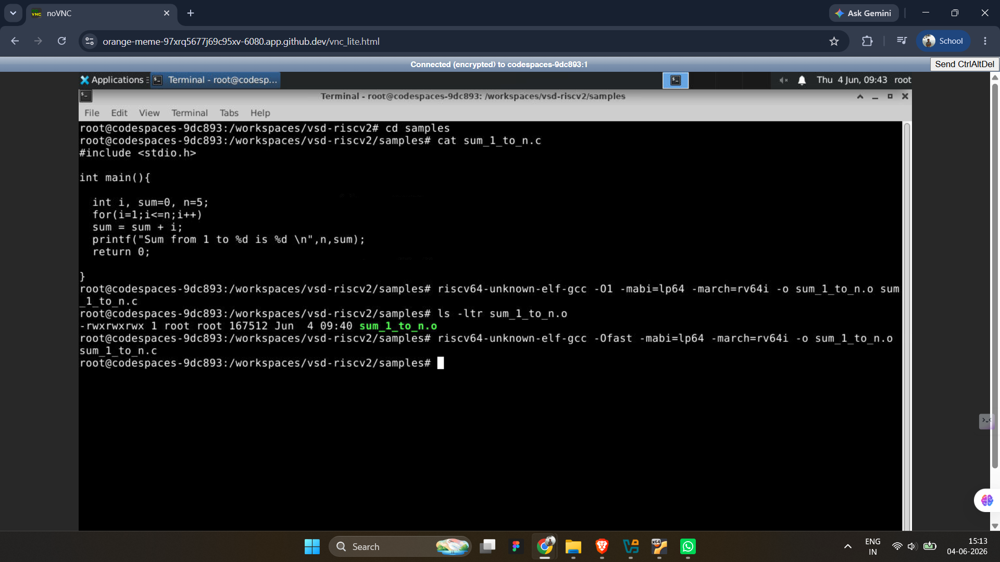
</p>

---

## Step 9: Generate Optimized Object Dump

Command:

```bash
riscv64-unknown-elf-objdump -d sum_1_to_n.o | less
```

The optimized assembly code was analyzed and compared with the previous output.

### Figure 9: -Ofast Optimization Analysis

<p align="center">
  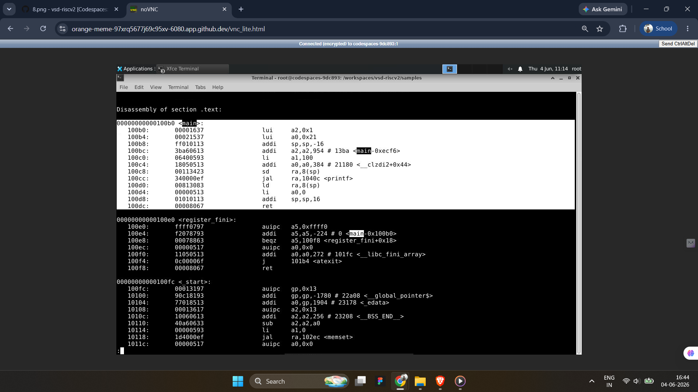
</p>

---

## Observations

* Native GCC compilation successfully generated the expected output.
* RISC-V GCC successfully generated RV64I executable code.
* Objdump produced the assembly instructions corresponding to the source code.
* Different optimization levels affect the generated machine instructions.
* Compilation with **-O1** optimization generated **15 instructions** in the `main()` function.
* Compilation with **-Ofast** optimization generated **12 instructions** in the `main()` function.
* The reduction in instruction count demonstrates that higher optimization levels produce more efficient machine code by eliminating redundant operations and improving execution efficiency.

---

> **Key Observation**
>
> -O1 optimization generated **15 instructions** in the `main()` function.
>
> -Ofast optimization generated **12 instructions** in the `main()` function.
>
> This demonstrates the impact of compiler optimization on instruction count and execution efficiency.

---

## Conclusion

The RISC-V toolchain was successfully installed and verified. A sample C program was compiled using both native GCC and RISC-V GCC. The generated executable was analyzed using objdump, providing insight into the assembly instructions generated by the RISC-V compiler.

A comparison between different optimization levels was also performed. The executable generated using **-O1** optimization contained **15 instructions** in the `main()` function, whereas the executable generated using **-Ofast** optimization contained only **12 instructions**. This demonstrates how compiler optimizations can reduce instruction count and improve code efficiency while preserving the functionality of the program.

The experiment successfully demonstrated the complete flow of C program compilation, RISC-V cross-compilation, object dump generation, and assembly-level analysis.

</details>

---

<!-- ========================================================================================================================================================== -->

<details>
<summary><b>Task 2 : SPIKE Simulation and Observation with -O1 and -Ofast</b></summary>

<br>

## Aim

### Part 1
To perform SPIKE simulation and analyze the RISC-V assembly generated using different compiler optimization levels (-O1 and -Ofast) for a simple C program.

### Part 2
To design and implement a simple application, **Multi-Floor Elevator Control System Simulation**, and compile, execute, simulate, and analyze it using RISC-V GCC and SPIKE.

---

# Part 1 : SPIKE Simulation and Observation using -O1 and -Ofast

## Program Used

### sum_1_to_n.c

```c
#include <stdio.h>

int main()
{
    int i, sum = 0, n = 100;

    for(i = 1; i <= n; i++)
        sum = sum + i;

    printf("Sum from 1 to %d is %d\n", n, sum);

    return 0;
}
```

## Step 1 : Native GCC Compilation and Verification

```bash
cat sum_1_to_n.c
gcc sum_1_to_n.c
./a.out
```

Output:

```text
Sum from 1 to 100 is 5050
```

---

## Step 2 : RISC-V Compilation using -Ofast

```bash
riscv64-unknown-elf-gcc -Ofast -mabi=lp64 -march=rv64i -o sum_1_to_n.o sum_1_to_n.c
spike pk sum_1_to_n.o
riscv64-unknown-elf-objdump -d sum_1_to_n.o | less
```

### Figure 1 : SPIKE Simulation using -Ofast

<p align="center">
  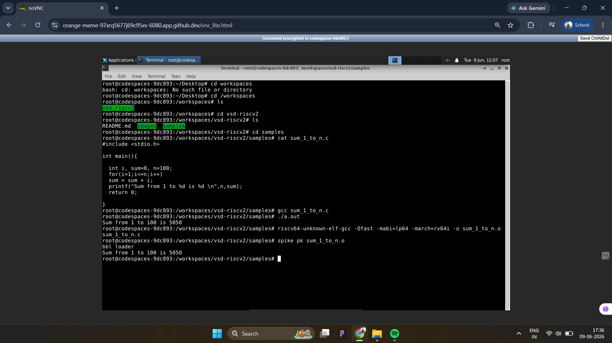
</p>

### Figure 2 : Main Function Assembly (-Ofast)

<p align="center">
  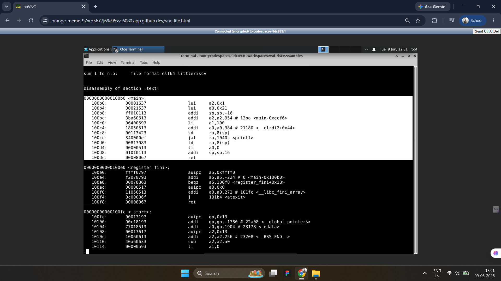
</p>

### SPIKE Debug Mode Analysis (-Ofast)

```bash
spike -d pk sum_1_to_n.o
until pc 0 100b0
reg 0 a2
reg 0 a0
reg 0 sp
```

### Figure 3 : Register Observation using SPIKE Debugger

<p align="center">
  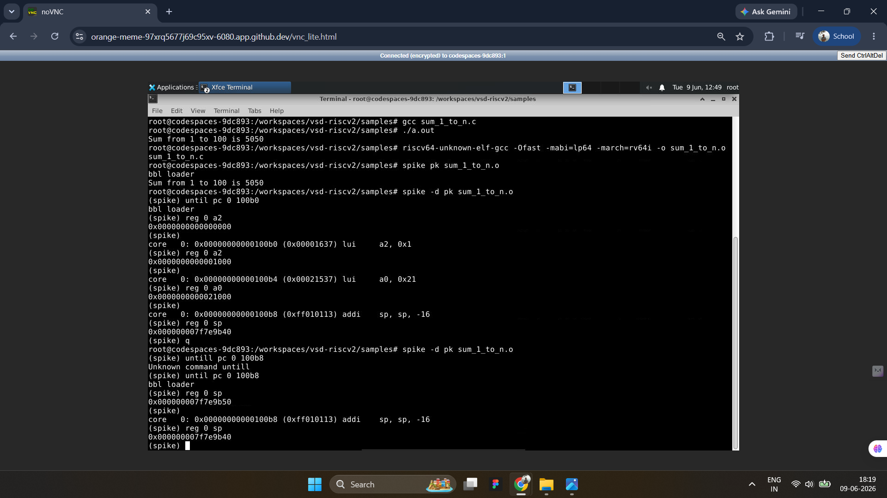
</p>

## Understanding LUI and ADDI Instructions

### LUI (Load Upper Immediate)

LUI loads a 20-bit immediate value into the upper 20 bits of a register.

### Figure 4 : LUI Instruction Format

<p align="center">
  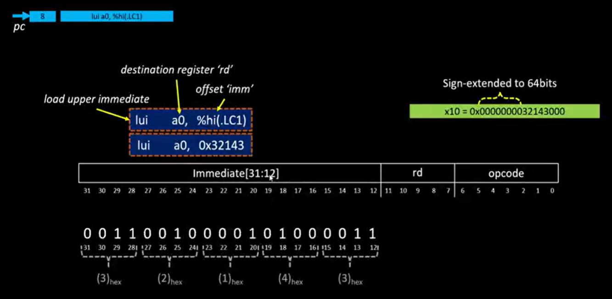
</p>

### ADDI (Add Immediate)

ADDI adds a signed immediate value to the contents of a register.

### Figure 5 : ADDI Instruction Format

<p align="center">
  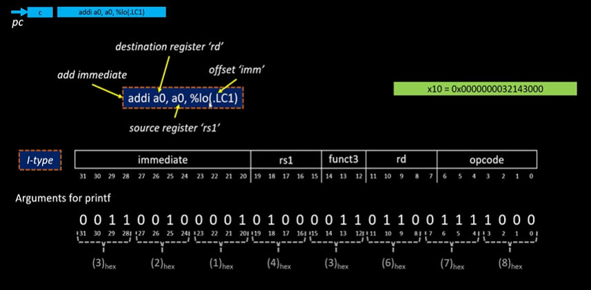
</p>

---

## SPIKE Debugging and Register Analysis

To understand the execution of RISC-V instructions at the register level, the program was executed in SPIKE debug mode. The debugger allows observation of register values before and after instruction execution.

### Commands Used

```bash
spike -d pk sum_1_to_n.o
```

The execution was halted at the beginning of the `main()` function and selected registers were examined.

### Analysis of LUI Instruction

The first instruction observed was:

```assembly
lui a2, 0x1
```

Register examined:

```bash
reg 0 a2
```

Initial value of register `a2`:

```text
0x0000000000000000
```

Value after instruction execution:

```text
0x0000000000001000
```

#### Explanation

The **LUI (Load Upper Immediate)** instruction loads a 20-bit immediate value into the upper bits of a register while the lower 12 bits are cleared.

For the instruction:

```assembly
lui a2, 0x1
```

the value loaded into register `a2` becomes:

```text
0x0000000000001000
```

This instruction is commonly used for constructing large constants and memory addresses.

---

### Analysis of LUI Instruction on Register a0

Instruction executed:

```assembly
lui a0, 0x21
```

Register examined:

```bash
reg 0 a0
```

Value after execution:

```text
0x0000000000021000
```

#### Explanation

The instruction loads the immediate value `0x21` into the upper 20 bits of register `a0`.

Resulting register value:

```text
0x0000000000021000
```

This value is later used as part of an address calculation for accessing program data and string literals.

---

### Analysis of ADDI Instruction

The next instruction observed was:

```assembly
addi sp, sp, -16
```

Register examined:

```bash
reg 0 sp
```

Value before execution:

```text
0x00000000007f7e9b50
```

Value after execution:

```text
0x00000000007f7e9b40
```

#### Explanation

The **ADDI (Add Immediate)** instruction performs arithmetic using a register and an immediate value.

For the instruction:

```assembly
addi sp, sp, -16
```

the stack pointer is decremented by 16 bytes.

This operation allocates stack space required for local variables and function execution.

---

## Step 3 : RISC-V Compilation using -O1

```bash
riscv64-unknown-elf-gcc -O1 -mabi=lp64 -march=rv64i -o sum_1_to_n.o sum_1_to_n.c
spike pk sum_1_to_n.o
riscv64-unknown-elf-objdump -d sum_1_to_n.o | less
```

### Figure 6 : Main Function Assembly (-O1)

<p align="center">
  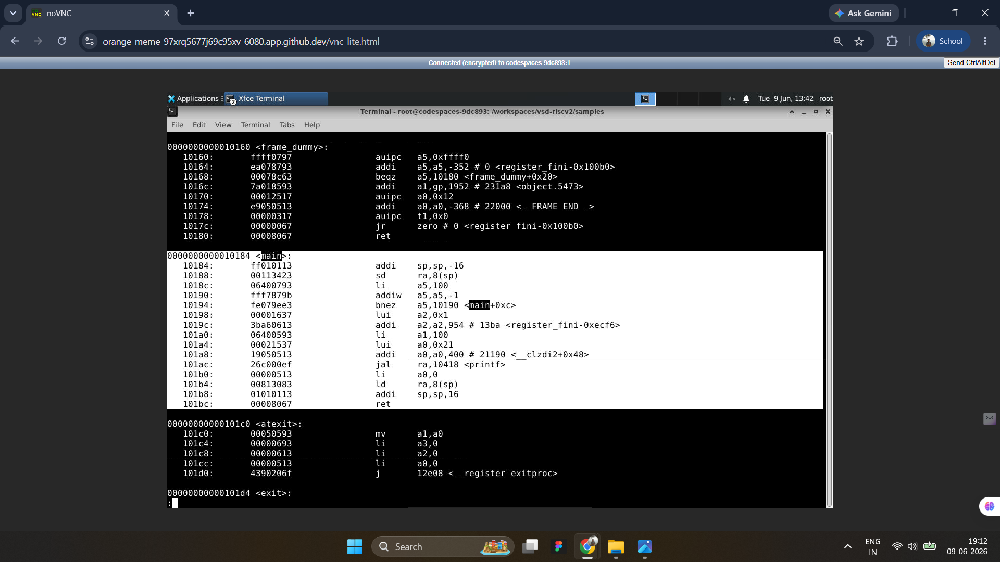
</p>

### Figure 7 : Register Observation using SPIKE Debugger for -O1

<p align="center">
  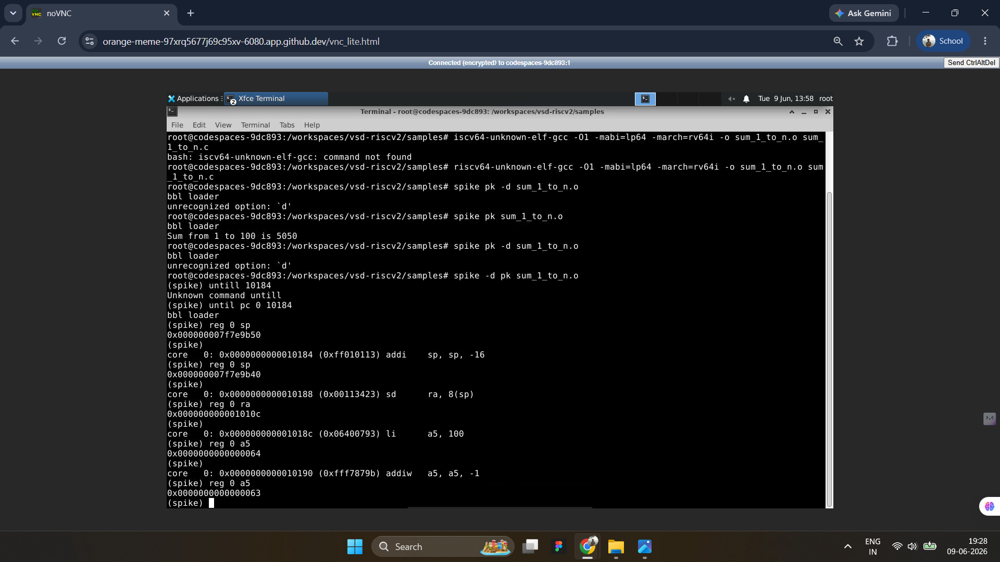
</p>

## Instruction Count Comparison

### -O1

15 Instructions

### -Ofast

12 Instructions

| Parameter | -O1 | -Ofast |
|------------|------|---------|
| Output | 5050 | 5050 |
| Loop Preserved | Yes | No |
| Main Function Instructions | 15 | 12 |

---

# Part 2 : Multi-Floor Elevator Control System Simulation

## Aim

To simulate the operation of a multi-floor elevator controller and analyze the generated RISC-V assembly using GCC, SPIKE, and Objdump.

## Step 1 : Program Creation and Native GCC Execution

```bash
gedit mfecs.c
gcc mfecs.c
./a.out
```

## Program Used

### Multi-Floor Elevator Control System Simulation (mfecs.c)

```c
#include <stdio.h>

int main()
{
    int current_floor = 0;
    int requested_floor;

    printf("================================\n");
    printf("Multi-Floor Elevator Controller\n");
    printf("================================\n");

    printf("current floor: %d\n", current_floor);
    printf("enter requested floor (0-5): ");
    scanf("%d", &requested_floor);

    if(requested_floor < 0 || requested_floor > 5)
    {
        printf("invalid request\n");
        return 0;
    }

    if(requested_floor == current_floor)
    {
        printf("elevator already at floor %d\n", current_floor);
        printf("door opened\n");
        printf("door closed\n");
        return 0;
    }

    if(requested_floor > current_floor)
    {
        printf("\nstate: moving_up\n");

        while(current_floor < requested_floor)
        {
            current_floor++;
            printf("reached floor %d\n", current_floor);
        }
    }
    else
    {
        printf("\nstate: moving_down\n");

        while(current_floor > requested_floor)
        {
            current_floor--;
            printf("reached floor %d\n", current_floor);
        }
    }

    printf("\nstate: door_open\n");
    printf("door opened at floor %d\n", current_floor);

    printf("\nstate: door_close\n");
    printf("door closed\n");

    printf("\nrequest completed successfully\n");

    return 0;
}
```

### Figure 8 : Program Execution using gcc

<p align="center">
  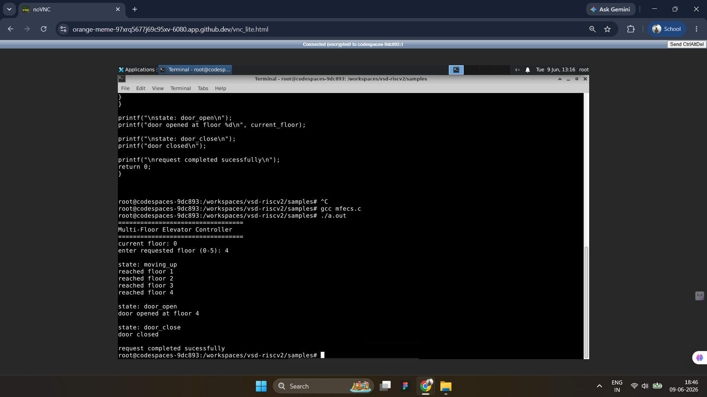
</p>

---

## Step 2 : RISC-V Compilation and SPIKE Simulation (-O1)

```bash
riscv64-unknown-elf-gcc -O1 -mabi=lp64 -march=rv64i -o mfecs.o mfecs.c
ls -ltr mfecs.o
spike pk mfecs.o
riscv64-unknown-elf-objdump -d mfecs.o | less
```

### Figure 9 : RISC-V Compilation and SPIKE Simulation (-O1)

<p align="center">
  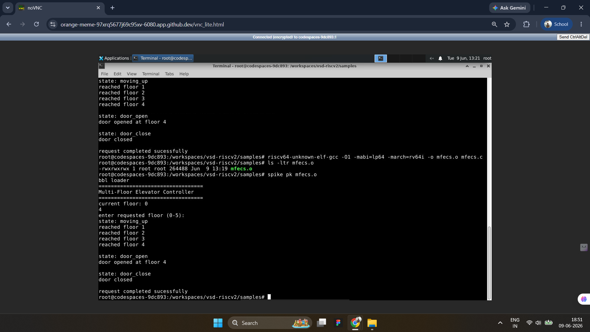
</p>

### Figure 10 : Main Function Start Address (-O1)

<p align="center">
  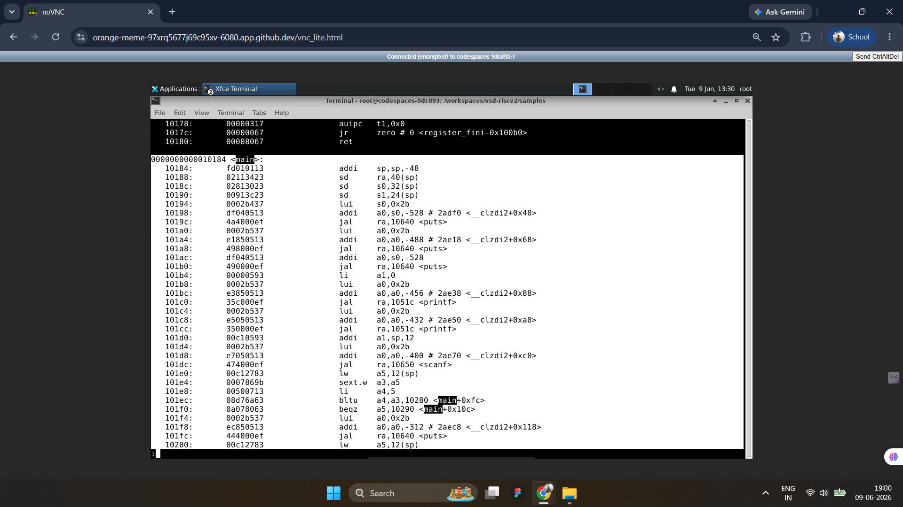
</p>

### Figure 11 : Main Function End Address (-O1)

<p align="center">
  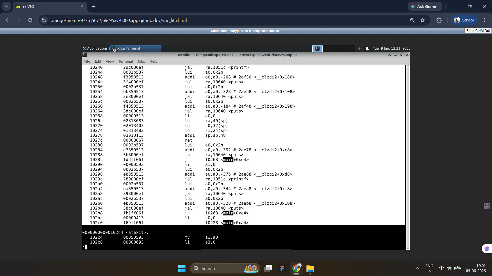
</p>

Instruction Count = 80

---

## Step 3 : RISC-V Compilation and SPIKE Simulation (-Ofast)

```bash
riscv64-unknown-elf-gcc -Ofast -mabi=lp64 -march=rv64i -o mfecs.o mfecs.c
spike pk mfecs.o
riscv64-unknown-elf-objdump -d mfecs.o | less
```

### Figure 12 : Main Function Start Address (-Ofast)

<p align="center">
  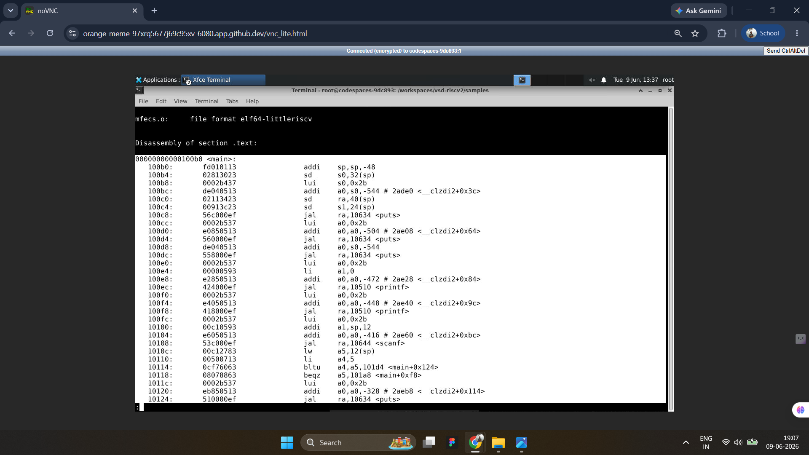
</p>

### Figure 13 : Main Function End Address (-Ofast)

<p align="center">
  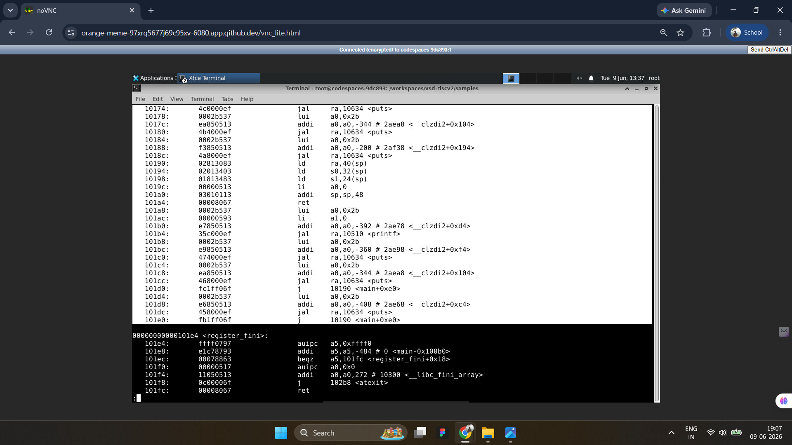
</p>

Instruction Count = 77

## Instruction Count Calculation

The number of instructions in the `main()` function was calculated using the start and end addresses obtained from the RISC-V object dump.

### Formula

```text
Number of Instructions = ((End Address - Start Address) / 4) + 1
```

Since each RV64I instruction occupies **4 bytes**, the address difference is divided by 4 to obtain the total number of instructions.

---

### Calculation for -O1

Start Address:

```text
0x10184
```

End Address:

```text
0x102c0
```

Calculation:

```text
(0x102c0 - 0x10184) / 4 + 1
= 0x13c / 4 + 1
= 316 / 4 + 1
= 79 + 1
= 80 Instructions
```

---

### Calculation for -Ofast

Start Address:

```text
0x100b0
```

End Address:

```text
0x101e0
```

Calculation:

```text
(0x101e0 - 0x100b0) / 4 + 1
= 0x130 / 4 + 1
= 304 / 4 + 1
= 76 + 1
= 77 Instructions
```


### Instruction Count Comparison Table

| Optimization Level | Start Address | End Address | Instruction Count |
|-------------------|--------------|------------|------------------|
| **-O1** | `0x10184` | `0x102c0` | **80** |
| **-Ofast** | `0x100b0` | `0x101e0` | **77** |

---

### Analysis

The executable generated using **-Ofast** contains fewer instructions than the executable generated using **-O1**.

| Optimization | Instructions |
|-------------|-------------|
| **-O1** | 80 |
| **-Ofast** | 77 |

The reduction of **3 instructions** indicates that the compiler performed additional optimizations such as instruction simplification, redundant code elimination, and improved code generation.

This demonstrates that higher optimization levels can reduce instruction count and potentially improve execution efficiency while maintaining the same functionality.

---

## Observations

* The `sum_1_to_n.c` program was successfully compiled and executed using both the native GCC compiler and the RISC-V GCC cross-compiler.
* The outputs obtained from native execution and SPIKE simulation were identical, confirming correct functionality of the generated RISC-V executable.
* SPIKE simulation successfully executed the program for both **-O1** and **-Ofast** optimization levels.
* RISC-V object dumps were generated and analyzed using the `objdump` utility.
* SPIKE debug mode enabled instruction-level execution analysis and register observation.
* The behavior of the **LUI** and **ADDI** instructions was studied by examining register values before and after execution.
* The **LUI** instruction was observed loading immediate values into the upper bits of registers, while the **ADDI** instruction was used for arithmetic and stack allocation operations.
* The instruction count of the `main()` function was reduced from **80 instructions** in **-O1** optimization to **77 instructions** in **-Ofast** optimization.
* The reduction in instruction count demonstrates that higher optimization levels generate more efficient machine code.
* A custom application, **Multi-Floor Elevator Control System Simulation**, was successfully developed and executed.
* The elevator controller correctly handled floor requests, movement between floors, door operations, and request completion.
* The application was successfully compiled using RISC-V GCC and executed using SPIKE, verifying compatibility with the RISC-V toolchain.
* Assembly-level analysis confirmed that compiler optimizations affect the generated machine instructions while preserving program functionality.

---

## Conclusion

Task 2 successfully demonstrated the use of the RISC-V software development and simulation flow. The sample C program was compiled with different optimization levels and executed using SPIKE, allowing detailed analysis of the generated assembly code and processor behavior. Through SPIKE debugging, the operation of key RISC-V instructions such as **LUI** and **ADDI** was examined, providing insight into register manipulation and stack management mechanisms.

A comparison of optimization levels showed that **-Ofast** generated a more compact implementation than **-O1**, reducing the instruction count of the `main()` function from **80** to **77** instructions. This highlights the impact of compiler optimizations on code efficiency.

Additionally, a **Multi-Floor Elevator Control System Simulation** was designed, compiled, and executed using both native GCC and the RISC-V GCC toolchain. The successful execution of the application in SPIKE verified the correctness of the generated RISC-V executable and demonstrated a practical control-system application relevant to digital design and embedded systems.

The task successfully covered RISC-V compilation, SPIKE simulation, debugging, object dump analysis, optimization comparison, and application-level implementation, providing a comprehensive understanding of the RISC-V software development workflow.

  
</details>

---

<!-- ========================================================================================================================================================== -->

<details>
<summary><b>Task 3 – Environment Setup & RISC-V Reference Bring-Up</b></summary>

<br>

## Objective

The objective of this task was to set up the development environment, verify the RISC-V toolchain, execute a reference RISC-V program, run the VSDFPGA Labs firmware example, and prepare the local machine for future FPGA and IP development activities.

---

# Environment Used

✅ GitHub Codespace

✅ Local Ubuntu Machine

---

# Step 1: GitHub Codespace Setup

The official VSD RISC-V repository was forked and a GitHub Codespace was created to provide a known-good development environment.

Repository:

```text
https://github.com/vsdip/vsd-riscv2
```

### Figure 1: GitHub Codespace Environment Setup

<p align="center">
  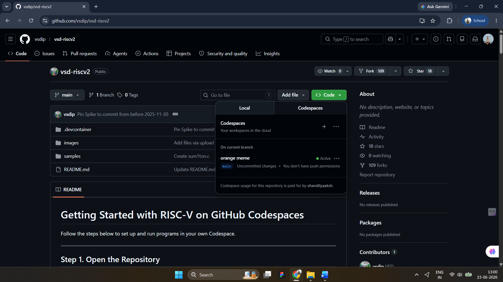
</p>

---

# Step 2: Verify RISC-V Reference Flow, Program Modification and Re-Execution

The provided RISC-V reference application was compiled and executed inside GitHub Codespace.

### Commands

```bash
riscv64-unknown-elf-gcc -o sum_1_to_n.o sum_1_to_n.c

spike pk sum_1_to_n.o
```

### Output

```text
Sum from 1 to 100 is 5050
```
---

## Program Modification and Re-Execution

The value of `n` was modified from:

```c
int n = 100;
```

to:

```c
int n = 10;
```

The program was recompiled and executed again.

### Commands

```bash
riscv64-unknown-elf-gcc -o sum_1_to_n.o sum_1_to_n.c

spike pk sum_1_to_n.o
```

### Output

```text
Sum from 1 to 10 is 55
```

### Figure 3: Modified Program Execution After Changing n from 100 to 10

<p align="center">
  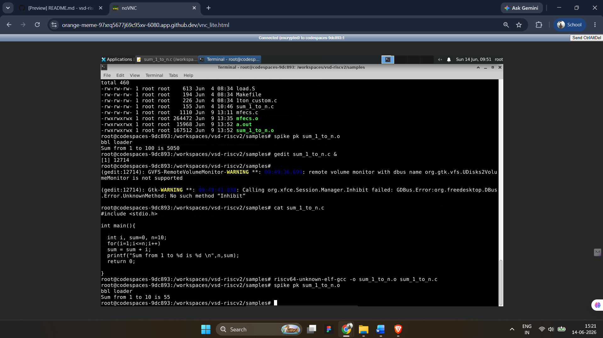
</p>

---

# Step 3: Clone and Run vsdfpga_labs in Codespace

The vsdfpga_labs repository was cloned inside the same Codespace environment.

### Commands

```bash
git clone https://github.com/vsdip/vsdfpga_labs.git
```

### Figure 4: Cloning vsdfpga_labs Repository in Codespace

<p align="center">
  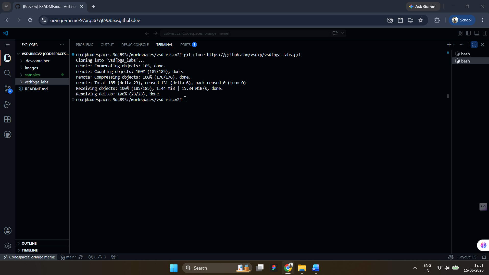
</p>

---

## Navigating to Firmware Workspace

### Commands

```bash
cd vsdfpga_labs/basicRISCV/Firmware

ls
```
---

## Inspecting Firmware Source Code

### Source Code

The firmware source code used in this task is available in:

```text
riscv_logo.c
```

```c
#include <stdio.h>

#define DELAY 700000

void wait_cycles(volatile int count) {
    while (count-- > 0) {
        __asm__ volatile("nop");
    }
}

void clear_screen() {
    printf("\033[2J\033[H");
}

void print_banner() {
    printf("************************************************************\n");
    printf("*                                                          *\n");
    printf("*   L E A R N   T O   T H I N K   L I K E   A   C H I P    *\n");
    printf("*                                                          *\n");
    printf("*      V S D S Q U A D R O N  F P G A   M I N I            *\n");
    printf("*                                                          *\n");
    printf("*B R I N G S   R I S C - V   T O   V S D  C L A S S R O O M*\n");
    printf("*                                                          *\n");
    printf("************************************************************\n\n");
}

int main() {
    while (1) {
        print_banner();
        wait_cycles(DELAY);
        clear_screen();
        wait_cycles(DELAY);
    }

    return 0;
}
```

### Compiling the Source Program using Spike

After cloning the `vsdfpga_labs` repository, the custom firmware source file `riscv_logo.c` was placed inside the `basicRISCV/Firmware` directory. The firmware was then compiled using the RISC-V GCC cross-compiler to generate a RISC-V executable object file.

```bash
riscv64-unknown-elf-gcc -o riscv_logo.o riscv_logo.c
spike pk riscv_logo.o
```
### Figure 4: Compilation of the custom riscv_logo application

<p align="center">
  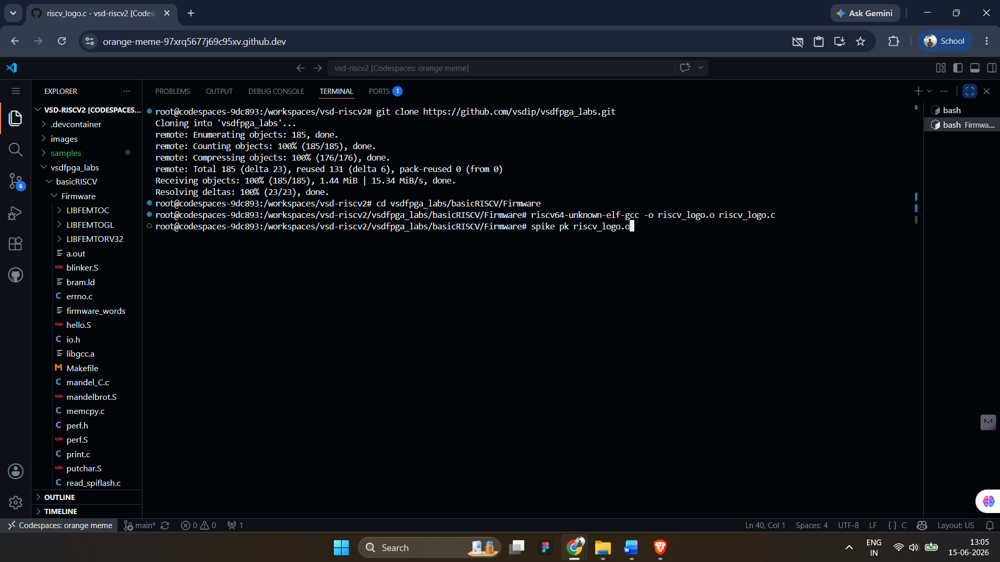
</p>

---

The output confirms successful execution of the firmware and displays the custom ASCII banner created in riscv_logo.c. This verifies that the RISC-V toolchain, Proxy Kernel, and Spike simulator are correctly configured and capable of executing user-developed firmware applications.

### Figure 4: Output in Codespace

<p align="center">
  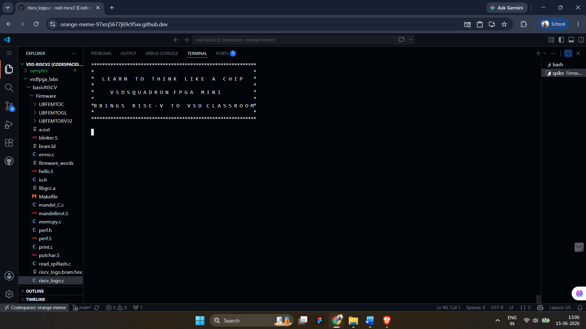
</p>

---

The Dockerfile provided in the repository was studied to understand:

* Required packages
* Toolchain dependencies
* Build environment setup
* Development workflow

Reference:

```text
https://raw.githubusercontent.com/vsdip/vsd-riscv2/refs/heads/main/.devcontainer/Dockerfile
```


# Step 5: Local Machine Preparation 

Prepared the local machine environment for future FPGA development activities.

```bash
mkdir ~/my_setup

cd ~/my_setup

git clone https://github.com/vsdip/vsd-riscv2.git

git clone https://github.com/vsdip/vsdfpga_labs.git
```

Figure 10: Local Development Environment Setup for FPGA Development
<p align="center">
  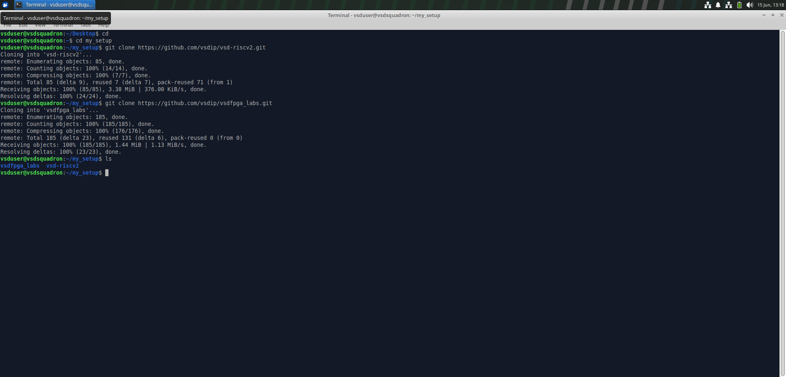
</p>

---

The local machine installation of the RISC-V GCC Toolchain and Spike ISA Simulator was verified.

```bash
which riscv64-unknown-elf-gcc

which spike

spike --help
```

### Figure 9: Verification of Local Spike Simulator Installation
<p align="center">
  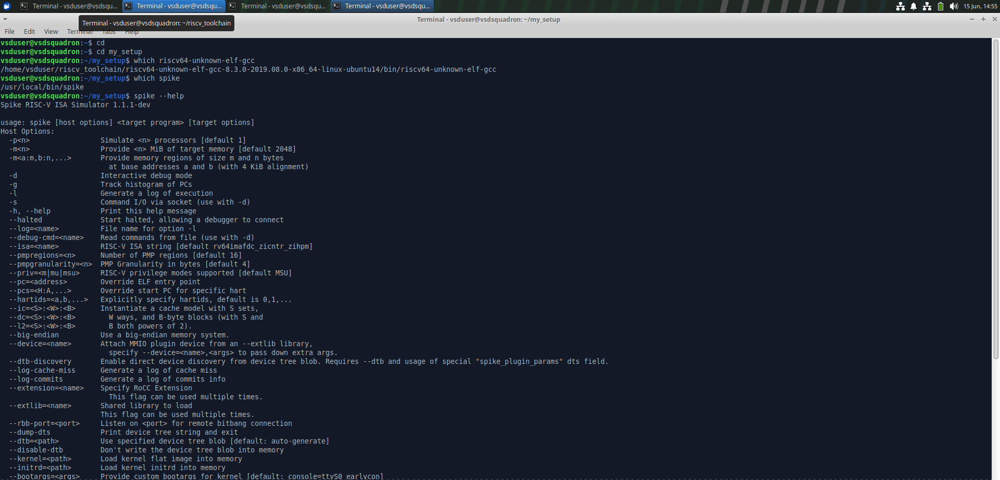
</p>

---

# Step 6: Execute Firmware Example on Local Machine

The VSDFPGA firmware example was compiled and executed locally using the installed RISC-V toolchain and Spike simulator.

### Navigate to Firmware Directory

```bash
cd ~/my_setup/vsdfpga_labs/basicRISCV/Firmware
```

### Compile Firmware

```bash
riscv64-unknown-elf-gcc -o riscv_logo.o riscv_logo.c
```

### Figure 10: Compilation of riscv_logo.c on Local Machine
<p align="center">
  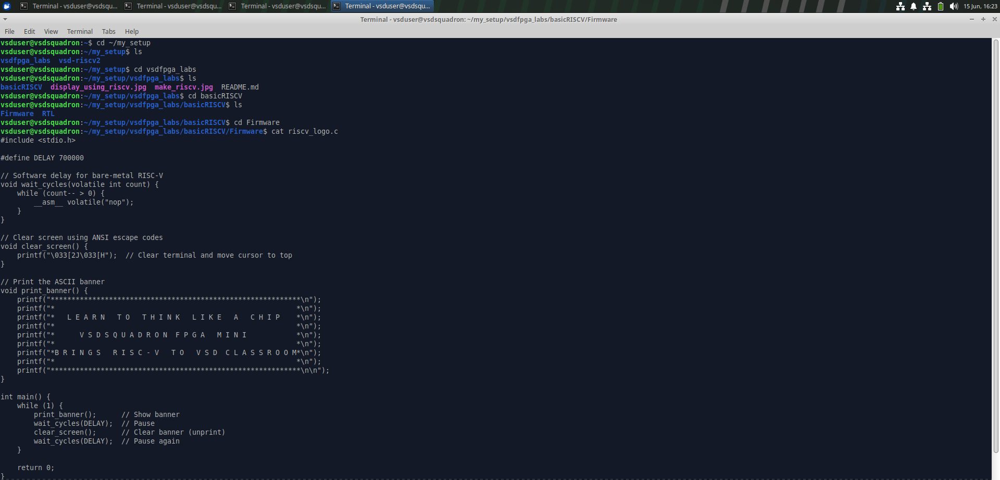
</p>

### Execute Firmware

```bash
spike pk riscv_logo.o
```

### Figure 11: Execution of riscv_logo Firmware Using Spike Simulator
<p align="center">
  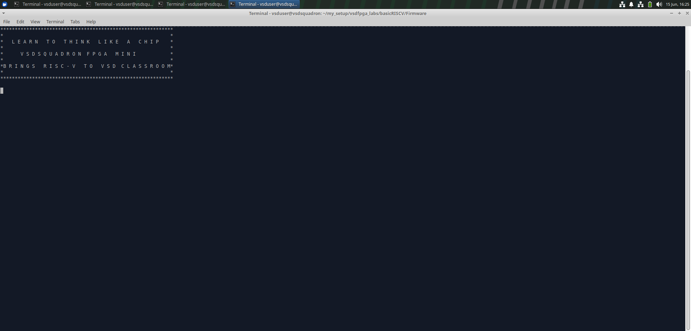
</p>

---

# Understanding Questions

## 1. Where is the RISC-V program located in the vsd-riscv2 repository?

The reference RISC-V programs are located inside the `samples` directory of the repository.

Example:

```text
samples/sum_1_to_n.c
```

---

## 2. How is the program compiled and loaded into memory?

The program is compiled using the RISC-V cross compiler:

```bash
riscv64-unknown-elf-gcc -o sum_1_to_n.o sum_1_to_n.c
```

The generated executable is loaded and executed through:

```bash
spike pk sum_1_to_n.o
```

where:

* Spike is the RISC-V ISA Simulator.
* PK (Proxy Kernel) loads the executable into simulated memory and transfers control to the program.

---

## 3. How does the RISC-V core access memory and memory-mapped IO?

The RISC-V processor accesses memory using load and store instructions. Memory-mapped IO is implemented by assigning peripherals to specific address ranges. The processor communicates with peripherals by reading from and writing to these addresses exactly like normal memory locations.

---

## 4. Where would a new FPGA IP block logically integrate in this system?

A new FPGA IP block would be connected to the SoC bus/interconnect architecture and assigned a dedicated memory-mapped address range. The RISC-V processor would communicate with the IP block through load/store operations directed to that address space.

---

# Results

Successfully completed:

* GitHub Codespace setup
* RISC-V reference program execution
* Program modification and verification
* VSDFPGA Labs repository setup
* Firmware source code inspection
* Local machine environment preparation
* RISC-V GCC Toolchain verification
* Spike ISA Simulator verification
* Firmware compilation and execution on the local machine

The environment is now ready for future RTL design, IP integration, FPGA simulation, and hardware implementation tasks.


</details>

---

<!-- ========================================================================================================================================================== -->

<details>
<summary><b>Task 4 - GPIO Peripheral Integration and Validation in RISC-V SoC</b></summary>

<br>

---

## Objective

The objective of this task was to design a custom memory-mapped peripheral — a **GPIO (General Purpose Input/Output) Output IP** — and integrate it into an existing RISC-V System-on-Chip (SoC) so that the embedded processor could control it exactly like any other memory location.

By the end of this task, the following was achieved:

- A new Verilog module (`gpio.v`) implementing a 32-bit, write-then-readback register was designed from scratch.
- The existing SoC (`riscv.v`) was studied to understand how its processor, bus, memory, and existing peripherals (LEDs, UART) communicate.
- The GPIO IP was wired into the SoC's shared memory bus using a dedicated, mentor-assigned base address (`0x2000_0000`).
- A bare-metal C firmware program was written to exercise the IP (write a known value, read it back, and report it).
- The full design was compiled and simulated using Icarus Verilog, and the GPIO write/read transactions were verified directly from simulation console output.

This task represents the first hands-on exposure to **custom IP design and SoC-level peripheral integration** — a foundational skill for any FPGA/ASIC or embedded systems engineer.

---

## Introduction

### What is a System-on-Chip (SoC)?

A System-on-Chip (SoC) is a single integrated design (in this case, implemented inside an FPGA) that combines a processor core, memory, and one or more peripherals onto a shared communication bus. Instead of having separate chips for the CPU, RAM, and I/O controllers, an SoC packages all of them together and lets the processor talk to every component through a common addressing scheme. The `basicRISCV` SoC used in this task already contained:

- A RISC-V **Processor** core (fetch–decode–execute state machine)
- An on-chip **Memory** (BRAM-based instruction/data RAM)
- A **UART** transmitter peripheral for serial communication
- A simple **LED** output peripheral

Task 4 extends this SoC by adding one more peripheral: a general-purpose output register.

### What is GPIO?

GPIO (General Purpose Input/Output) is one of the most fundamental peripherals in any embedded system. A GPIO peripheral exposes a register (or set of registers) that software can write to or read from; the value of that register is reflected directly on physical pins (or, internally, on a bus signal) that can drive LEDs, relays, transistors, or other external circuitry. In this task, a **write-only-functionality, but read-back capable**, 32-bit GPIO output register was implemented:

- Writing a value updates the internal `gpio_out` signal.
- Reading the register returns the **last written value**, not fresh external input (hence "Output IP").

### Why GPIO Peripherals are Important in Embedded Systems

GPIO is the simplest possible bridge between software and the physical world. Almost every embedded product — from a blinking LED to an industrial controller — uses GPIO somewhere. Learning to build a GPIO peripheral teaches the universal pattern used for **every** memory-mapped peripheral: a register, a write-enable path, a read-back path, and an address decode that connects it to the bus. Once this pattern is understood, building more complex IP (timers, SPI, I2C controllers) becomes a natural extension.

### How GPIO is Connected to the Processor Through the SoC Bus

In this SoC, the processor does not talk to peripherals directly — it talks to a **shared memory bus** using five signals: `mem_addr`, `mem_rdata`, `mem_rstrb`, `mem_wdata`, and `mem_wmask`. The top-level SoC module (`riscv.v`) decodes the address on every bus transaction and routes the transaction to the correct destination — RAM, the bit-mapped IO peripherals (LEDs/UART), or, after this task, the new GPIO IP. This is the essence of **memory-mapped I/O**: peripherals look like ordinary memory locations to the software running on the CPU.

---

## System Architecture

### Processor Core

The existing `Processor` module in `riscv.v` is a RISC-V CPU implemented as a synchronous state machine (`FETCH_INSTR`, `WAIT_INSTR`, `LOAD`, etc.). On every bus transaction it drives `mem_addr`/`mem_wdata`/`mem_wmask` and samples `mem_rdata`, using `mem_rstrb` to indicate it is requesting data.

### Interconnect / Bus

The "bus" in this SoC is a simple, flat, single-master bus — there is no arbiter or crossbar because there is only one master (the CPU core). The interconnect logic lives directly in the top-level `riscv.v` file as a set of `wire` assignments and `case`/ternary expressions that:

1. Decode the incoming address into region-select signals (`isRAM`, `isIO`, `gpio_sel`).
2. Generate per-peripheral enable signals (`gpio_write`, `gpio_read`, `uart_valid`, etc.).
3. Multiplex the read data from whichever peripheral is selected back onto `mem_rdata`.

### GPIO Peripheral

The new `GPIO` module (`gpio.v`) is the peripheral itself. It contains a single 32-bit register (`gpio_out`) with synchronous write logic and combinational readback logic, plus an active-low reset.

### Memory Map

| Region | Address / Decode Condition | Existing or New | Description |
|---|---|---|---|
| RAM | `isRAM = !isIO` (general address space) | Existing | 6 KB instruction/data BRAM (`MEM[0:1535]`, 4 bytes/word) |
| Bit-mapped IO page (LEDs) | `isIO & mem_wordaddr[IO_LEDS_bit]` | Existing | Drives 5 onboard LEDs |
| Bit-mapped IO page (UART) | `isIO & mem_wordaddr[IO_UART_DAT_bit / IO_UART_CNTL_bit]` | Existing | UART transmit data/status |
| **GPIO Output Register** | `mem_addr == 32'h2000_0000` (`gpio_sel`) | **New (this task)** | 32-bit general-purpose output register |

> **Design note:** The existing LED/UART peripherals use a *bit-indexed* IO scheme — a single `isIO` flag (`mem_addr[22]`) combined with one-hot bits inside the word address (`IO_LEDS_bit`, `IO_UART_DAT_bit`, `IO_UART_CNTL_bit`). The GPIO IP instead uses a **dedicated, full-address comparison** (`gpio_sel = (mem_addr == 32'h2000_0000)`), exactly matching the mentor-assigned base address from the task specification. This shows two valid address-decoding styles coexisting in the same SoC: compact bit-mapped decoding for tightly related control/status bits, and a simple absolute-address compare for a standalone peripheral page.

### External I/O Pins

In this task, the GPIO output (`gpio_out`) is exposed **internally** within the SoC (as required by the "Mandatory" simulation step). It can optionally be routed to physical FPGA pins (e.g., onboard LEDs) in the optional hardware-validation step, but that was not required for completion of Task 4.

---

## Implementation Steps

> Each step below corresponds to one screenshot captured during the implementation process, in chronological order.

### Step 1: Exploring the Existing SoC Directory Structure

<p align="center">
  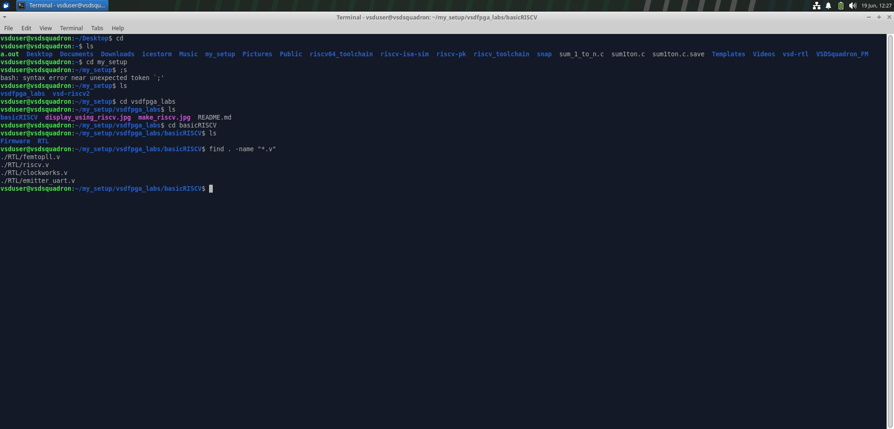
</p>

**Description**
The terminal session begins by navigating the project workspace (`~/my_setup/vsdfpga_labs/basicRISCV`) and using `find . -name "*.v"` to enumerate every Verilog source file in the project: `femtopll.v`, `riscv.v`, `clockworks.v`, and `emitter_uart.v`. The project is organized into two folders — `Firmware` (C source for the embedded software) and `RTL` (hardware description files).

**Technical Analysis**

| Item | Observation |
|---|---|
| Files found | `femtopll.v` (PLL/clock generation), `riscv.v` (CPU + SoC top), `clockworks.v` (reset/clock gearbox), `emitter_uart.v` (UART transmitter core) |
| Directory layout | `basicRISCV/RTL` (hardware), `basicRISCV/Firmware` (software) |
| Tooling used | Plain Linux shell (`cd`, `ls`, `find`) |

**Importance**
Before writing a single line of new RTL, it is essential to understand what already exists. This step corresponds directly to the task's **Step 1: Understand the existing SoC (Mandatory)** — locating every hardware module so that the new GPIO IP can be added consistently with the existing project structure, rather than duplicating or conflicting with existing files.

---

### Step 2: Inspecting the Memory and Processor Module Interfaces

<p align="center">
  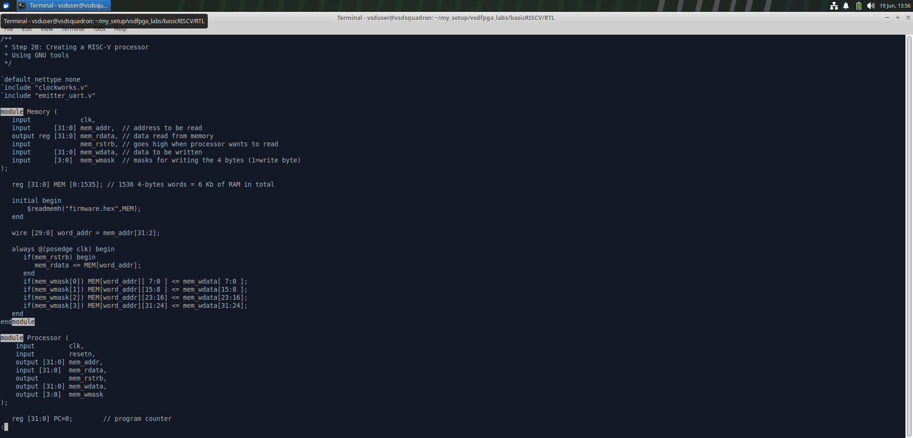
</p>

**Description**
The `riscv.v` file is opened and the beginning of the file is reviewed. Two key modules are visible: `Memory` (the on-chip RAM controller) and the start of `Processor` (the RISC-V CPU). The `Memory` module declares the canonical memory-bus port list: `mem_addr`, `mem_rdata`, `mem_rstrb`, `mem_wdata`, and `mem_wmask`, and stores 1,536 32-bit words (6 KB) loaded from `firmware.hex` via `$readmemh`.

**Technical Analysis**

| Signal | Direction (from Memory's view) | Purpose |
|---|---|---|
| `mem_addr[31:0]` | input | Address to be read or written |
| `mem_rdata[31:0]` | output reg | Data returned to the processor |
| `mem_rstrb` | input | Asserted by the CPU when it wants to read |
| `mem_wdata[31:0]` | input | Data to be written |
| `mem_wmask[3:0]` | input | Per-byte write mask (byte-write granularity) |

The `Processor` module mirrors these same five signals but with inverted directions (it drives `mem_addr`, `mem_wdata`, `mem_wmask`, `mem_rstrb` as outputs and receives `mem_rdata` as an input), confirming the bus convention used throughout the SoC.

**Importance**
This is the most important signal set in the entire task. Any new peripheral — including the GPIO IP — must eventually be wired to a subset of these same five signals. Understanding their exact widths, polarities, and timing here prevents incorrect connections later during integration.

---

### Step 3: Studying the Existing UART Peripheral and Address Signal Flow

<p align="center">
  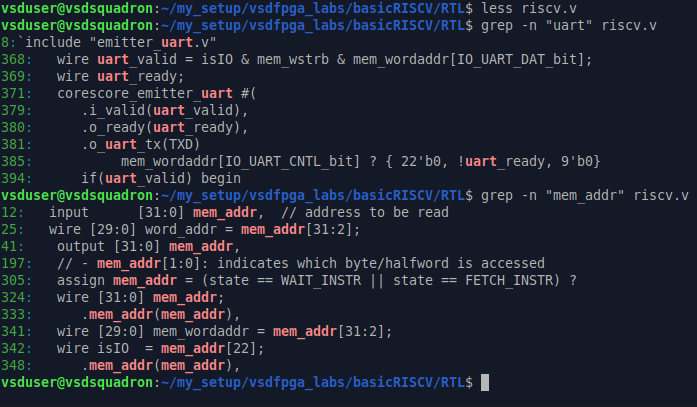
</p>

**Description**
Using `grep -n "uart" riscv.v` and `grep -n "mem_addr" riscv.v`, the existing UART peripheral instantiation is located, along with every place `mem_addr` is consumed in the file — from the byte-address-to-word-address conversion (`word_addr = mem_addr[31:2]`) to the final address-decode logic (`isIO = mem_addr[22]`).

**Technical Analysis**

- `wire uart_valid = isIO & mem_wstrb & mem_wordaddr[IO_UART_DAT_bit];` — the UART transmit-trigger condition combines the IO-region flag, a write-strobe, and a specific bit of the word address.
- `corescore_emitter_uart #( ... ) UART ( .i_valid(uart_valid), .o_ready(uart_ready), .o_uart_tx(TXD) );` — shows the canonical instantiation pattern: parameters, then a port map connecting bus-derived enables to the peripheral's native ports.
- `wire [29:0] word_addr = mem_addr[31:2];` confirms that addresses are byte-addressed at the bus level but word-addressed inside memory/IO logic (the lowest two bits select byte lanes, not separate words).

**Importance**
The UART instantiation is effectively a **template** for how *any* peripheral should be wired into this SoC: derive an enable condition from the bus signals, instantiate the peripheral, and connect its outputs back into the read-data path. This pattern was directly reused (with modifications) for the GPIO IP.

---

### Step 4: Understanding the One-Hot/Bit-Indexed IO Decoding Scheme

<p align="center">
  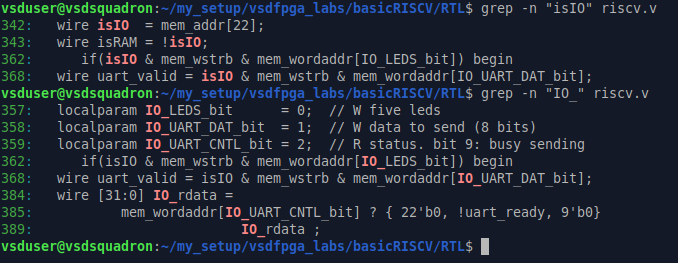
</p>

**Description**
Two more `grep` searches — for `"isIO"` and `"IO_"` — reveal the complete existing address-decoding convention used for the LED and UART peripherals. A single bit of the address (`mem_addr[22]`) flags the entire transaction as "IO" rather than "RAM," and within the IO page, individual peripherals are selected by checking specific bits of the *word* address using named `localparam` constants.

**Technical Analysis**

| Signal/Parameter | Value/Expression | Role |
|---|---|---|
| `isIO` | `mem_addr[22]` | 1 = address targets the IO page, 0 = RAM |
| `isRAM` | `!isIO` | Complement of `isIO` |
| `IO_LEDS_bit` | `0` | Bit position selecting the LED register |
| `IO_UART_DAT_bit` | `1` | Bit position selecting the UART data register |
| `IO_UART_CNTL_bit` | `2` | Bit position selecting the UART status/control register |

**Importance**
This step revealed that the existing IO scheme is **bit-indexed within a 4 MB-aligned IO page** (`mem_addr[22]`), not a generic address-range decoder. Recognizing this distinction was critical: the GPIO IP's mentor-assigned base address (`0x2000_0000`) does *not* fall inside this existing IO page (bit 22 of `0x2000_0000` is `0`), so a **new, independent decode condition** had to be created for GPIO rather than simply adding another `IO_*_bit`. This understanding directly shaped the architecture decision documented in the System Architecture section above.

---

### Step 5: Writing the GPIO IP RTL Module

<p align="center">
  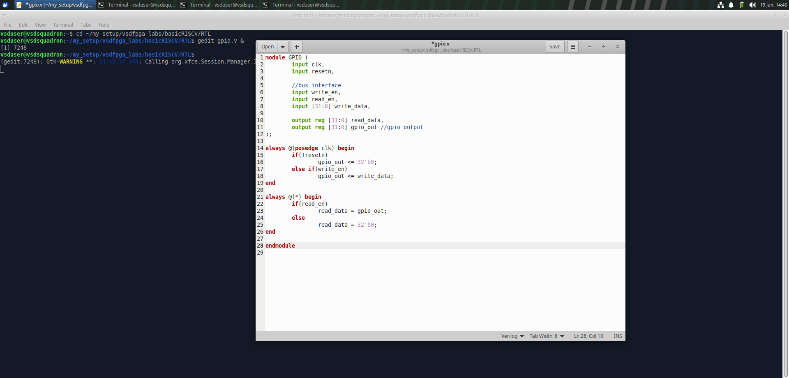
</p>

**Description**
A new file, `gpio.v`, is created in `gedit` and the complete `GPIO` module is written. The module has a clean, minimal interface: `clk`, `resetn`, a bus-style `write_en`/`read_en`/`write_data` interface, and two outputs — `read_data` (back to the bus) and `gpio_out` (the peripheral's actual register value, available for external use).

**Technical Analysis**

```verilog
module GPIO (
    input         clk,
    input         resetn,

    // bus interface
    input         write_en,
    input         read_en,
    input  [31:0] write_data,

    output reg [31:0] read_data,
    output reg [31:0] gpio_out   // gpio output
);

always @(posedge clk) begin
    if (!resetn)
        gpio_out <= 32'b0;
    else if (write_en)
        gpio_out <= write_data;
end

always @(*) begin
    if (read_en)
        read_data = gpio_out;
    else
        read_data = 32'b0;
end
endmodule
```

| Block | Type | Behavior |
|---|---|---|
| Write path | Synchronous (`always @(posedge clk)`) | On reset, clears `gpio_out`; on `write_en`, latches `write_data` into `gpio_out` |
| Read path | Combinational (`always @(*)`) | Drives `read_data` with the current value of `gpio_out` when `read_en` is asserted, otherwise `0` |

This is a textbook **synchronous-write, combinational-read register** design — the simplest and most robust pattern for a memory-mapped register, fully satisfying the task's functional specification ("writing updates the output; reading returns the last written value").

**Importance**
This is the core deliverable of the task: the IP itself. Implementing register storage, write logic, and readback logic with synchronous design discipline (active-low reset, single clock domain, no combinational feedback loops) ensures the peripheral will behave predictably both in simulation and on real silicon/FPGA fabric.

---

### Step 6: Syntax-Checking the New GPIO Module in Isolation

<p align="center">
  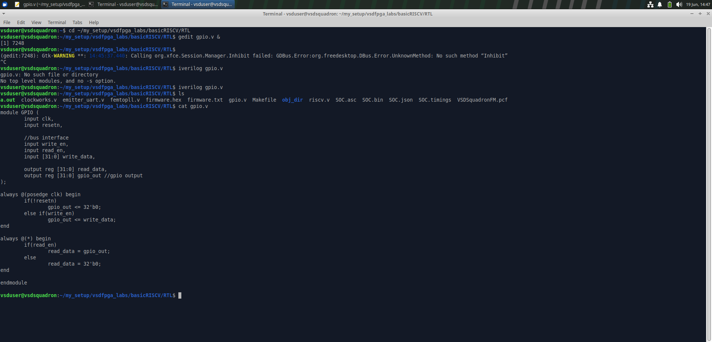
</p>

**Description**
The terminal is used to compile `gpio.v` on its own with `iverilog gpio.v`. The first attempt fails ("No such file or directory") because the file had not yet been saved from `gedit`; after saving, the second `iverilog gpio.v` attempt succeeds silently (no errors), confirming the module compiles. The full saved file contents are then printed with `cat gpio.v` to provide a clean record of the final RTL.

**Technical Analysis**
- `iverilog` is being used purely as a **syntax/elaboration checker** here — `gpio.v` has no top-level testbench, so `iverilog` reports `"No top level modules, and no -s option"` style warnings/errors if the file is missing, but compiles cleanly once the module exists and is syntactically valid.
- This confirms port declarations, register declarations, and `always` block syntax are all correct *before* the module is wired into the larger SoC, where errors would be harder to localize.

**Importance**
Verifying a new module compiles **in isolation** before integration is a standard hardware-design best practice. It isolates syntax/elaboration errors from integration errors, making debugging dramatically faster — if something breaks after integration, the engineer already knows `gpio.v` itself is sound.

---

### Step 7: Re-Confirming the Existing IO Bit Assignments Before Integration

<p align="center">
  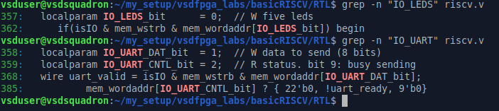
</p>

**Description**
Immediately before modifying `riscv.v`, two targeted `grep` searches re-confirm the exact existing bit assignments: `IO_LEDS_bit = 0` and `IO_UART_DAT_bit = 1` / `IO_UART_CNTL_bit = 2`, along with how they are used in conditional logic (`if(isIO & mem_wstrb & mem_wordaddr[IO_LEDS_bit])`) and in the UART status readback expression.

**Technical Analysis**
This is a verification/sanity-check step rather than a new discovery — it confirms no bit position will be accidentally reused or shadowed when GPIO logic is added nearby in the file.

**Importance**
In digital design, **address/bit collisions** are a common and hard-to-debug class of bugs. Re-verifying the existing decode constants immediately before adding new decode logic for GPIO is a disciplined way of avoiding such collisions, especially since the GPIO IP uses a different decode mechanism (full-address compare) that must not interfere with the existing bit-indexed scheme.

---

### Step 8: Including the New GPIO Module in the SoC Top-Level File

<p align="center">
  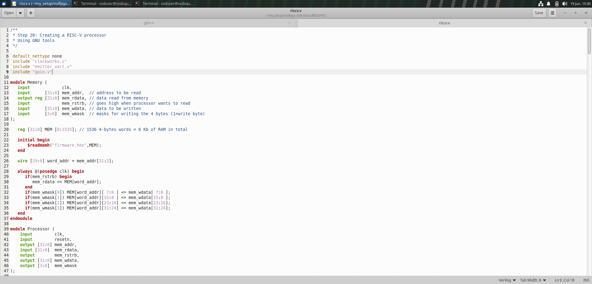
</p>

**Description**
`riscv.v` is opened side-by-side with `gpio.v` in `gedit`, and a new line is added near the top of the file: `` `include "gpio.v" `` — placed immediately after the existing `` `include "clockworks.v" `` and `` `include "emitter_uart.v" `` directives.

**Technical Analysis**
Icarus Verilog (and the broader SoC build flow) uses the preprocessor `` `include `` directive to merge multiple Verilog source files into a single compilation unit at preprocessing time. By adding `gpio.v` to this list, the `GPIO` module definition becomes visible to the rest of `riscv.v`, enabling it to be instantiated later in the same file.

**Importance**
This is the first concrete **integration** action — until this line is added, the `GPIO` module exists as an orphaned file with no connection to the SoC. This single include statement is what allows the top-level module to subsequently instantiate `GPIO` as a sub-module, just as it already does for `clockworks` and `emitter_uart`.

---

### Step 9: Adding Address Decode and Enable Generation Logic for GPIO

<p align="center">
  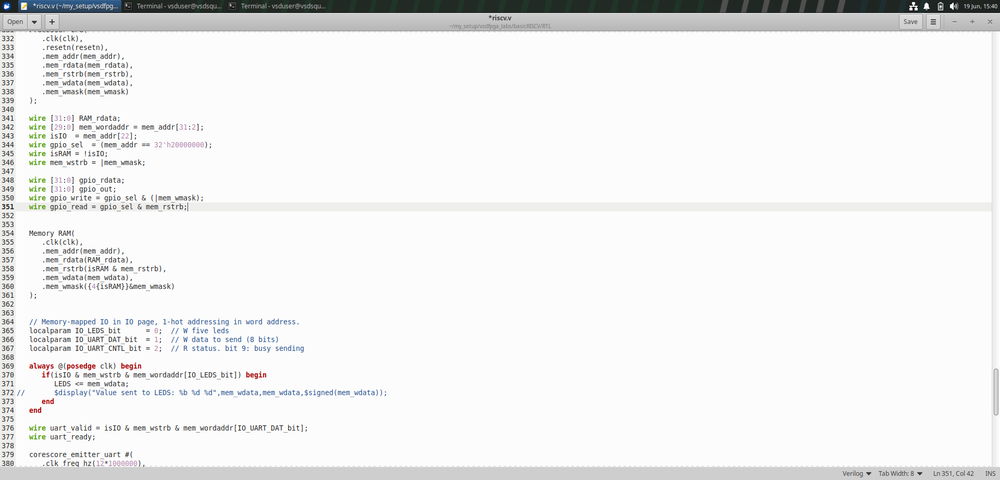
</p>

**Description**
Deeper inside `riscv.v`, immediately after the `Processor` instantiation, new wires are added: `gpio_sel = (mem_addr == 32'h20000000)`, `gpio_rdata`, `gpio_out`, `gpio_write = gpio_sel & (|mem_wmask)`, and `gpio_read = gpio_sel & mem_rstrb`. These sit alongside the pre-existing `RAM_rdata`, `mem_wordaddr`, `isIO`, `isRAM`, and `mem_wstrb` wires.

**Technical Analysis**

| New Signal | Expression | Meaning |
|---|---|---|
| `gpio_sel` | `(mem_addr == 32'h2000_0000)` | True only when the CPU addresses the exact GPIO base address |
| `gpio_write` | `gpio_sel & (|mem_wmask)` | True when GPIO is selected **and** at least one byte lane of the write mask is set (i.e., a write is occurring) |
| `gpio_read` | `gpio_sel & mem_rstrb` | True when GPIO is selected **and** the CPU has asserted its read-strobe |

The reduction-OR operator (`|mem_wmask`) is used to convert the 4-bit byte write mask into a single "is this a write" flag — equivalent to the pre-existing `mem_wstrb = |mem_wmask` signal used elsewhere in the file, but expressed inline here.

**Importance**
This is the heart of **address decoding**: translating a raw bus address into a peripheral-specific enable signal. Without `gpio_write`/`gpio_read`, the new `GPIO` module would have no way of knowing *when* the CPU intends to interact with it versus simply passing through an unrelated address.

---

### Step 10: Locating the Read-Data Multiplexer That Needed Modification

<p align="center">
  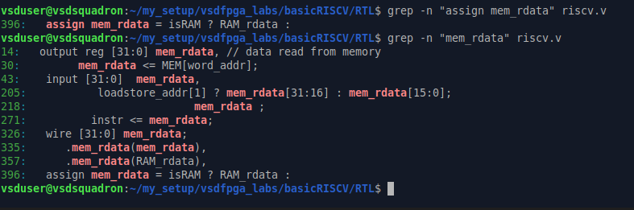
</p>

**Description**
Two `grep` searches — for `"assign mem_rdata"` and `"mem_rdata"` — locate every place the final read-data signal is produced or consumed, culminating in the single line `assign mem_rdata = isRAM ? RAM_rdata :` (continuing on the next line), which at this point in the process does **not** yet account for GPIO.

**Technical Analysis**
`mem_rdata` is the single signal the `Processor` module samples for every read (instruction fetch or load). Architecturally, it must be a **priority-encoded multiplexer** across every possible source: RAM, the bit-mapped IO page, and (now) the GPIO IP. Locating every reference to `mem_rdata` before editing ensures the new GPIO term is inserted in exactly the right place in this mux chain.

**Importance**
Modifying a multiplexer in the wrong location, or with the wrong priority, can silently break instruction fetch or existing peripherals. This investigative step (pure `grep`, no edits yet) reduces the risk of a regression when the GPIO term is added in the next step.

---

### Step 11: Confirming the Read-Strobe Signal Semantics

<p align="center">
  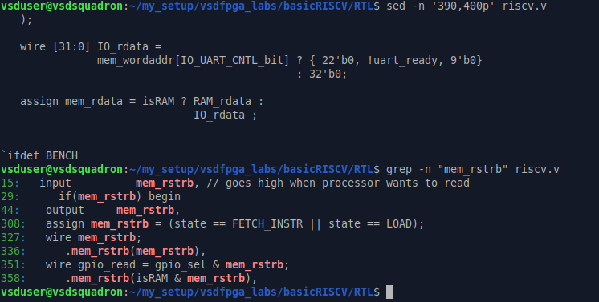
</p>

**Description**
A `sed`-extracted snippet of the existing IO read-data expression is reviewed, followed by `grep -n "mem_rstrb" riscv.v`, which shows every usage of the read-strobe signal — from its declaration (`input mem_rstrb, // goes high when processor wants to read`) through to its use in the `Processor`'s state machine (`assign mem_rstrb = (state == FETCH_INSTR || state == LOAD);`) and its newly added consumer, `gpio_read = gpio_sel & mem_rstrb`.

**Technical Analysis**
- `mem_rstrb` is asserted by the CPU during **both** instruction fetch and explicit load instructions — meaning any peripheral gated by `mem_rstrb` must also be gated by its own address-select signal (`gpio_sel`) to avoid false triggers during ordinary instruction fetches.
- The RAM instance is similarly gated: `.mem_rstrb(isRAM & mem_rstrb)` — confirming the established convention of `region_select & mem_rstrb` for every peripheral's read-enable.

**Importance**
This step validates that the newly written `gpio_read = gpio_sel & mem_rstrb` expression follows the *exact same convention* already used by the RAM module, ensuring architectural consistency and avoiding spurious read-enables when the CPU is fetching unrelated instructions.

---

### Step 12: Extending the Read-Data Multiplexer to Include GPIO

<p align="center">
  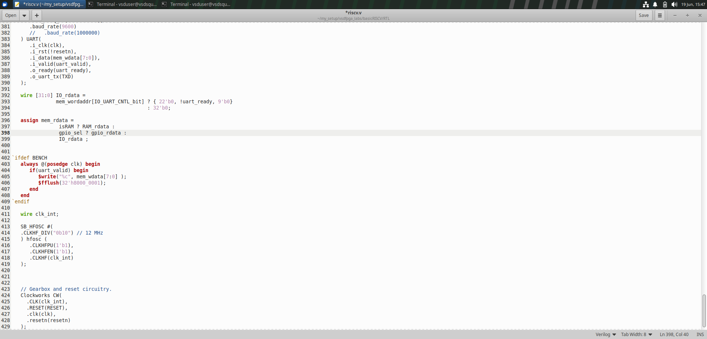
</p>

**Description**
Inside the `gedit` view of `riscv.v` (lines ~381–429), the UART instantiation and its status-readback expression (`IO_rdata`) are visible, immediately followed by the modified multiplexer:

```verilog
assign mem_rdata =
            isRAM   ? RAM_rdata :
            gpio_sel ? gpio_rdata :
                       IO_rdata ;
```

Below this, the simulation-only UART console-print block (`` `ifdef BENCH ``) and the on-chip oscillator (`SB_HFOSC`) / `Clockworks` reset-gearbox instantiations are visible, unmodified.

**Technical Analysis**
The single-line addition `gpio_sel ? gpio_rdata :` inserts the GPIO IP as a new branch in the existing ternary-chain multiplexer, positioned between the RAM branch and the legacy IO branch. This is the **read path** completion: it allows data stored inside the `GPIO` module's `gpio_out` register to actually reach the CPU's `mem_rdata` input when the GPIO address is selected.

**Importance**
A memory-mapped peripheral is only "memory-mapped" if **both** directions of the bus work — write *and* read. This step completes the read direction, making the GPIO register genuinely readable by software, fulfilling the task's explicit requirement: *"Reading the register returns the last written value."*

---

### Step 13: Instantiating the GPIO Peripheral in the SoC Top-Level

<p align="center">
  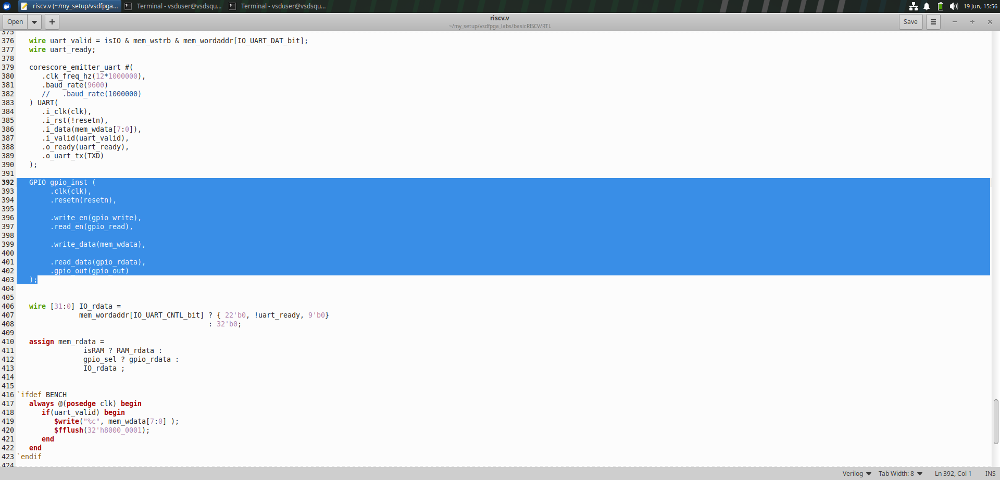
</p>

**Description**
The actual module instantiation is added directly beneath the UART instance:

```verilog
GPIO gpio_inst (
    .clk(clk),
    .resetn(resetn),

    .write_en(gpio_write),
    .read_en(gpio_read),

    .write_data(mem_wdata),

    .read_data(gpio_rdata),
    .gpio_out(gpio_out)
);
```

**Technical Analysis**

| GPIO Port | Connected To | Source/Sink |
|---|---|---|
| `clk` | `clk` | Global SoC clock |
| `resetn` | `resetn` | Global SoC active-low reset |
| `write_en` | `gpio_write` | Decoded write-enable from Step 9 |
| `read_en` | `gpio_read` | Decoded read-enable from Step 9 |
| `write_data` | `mem_wdata` | Raw CPU write-data bus (shared with RAM/UART) |
| `read_data` | `gpio_rdata` | Feeds into the `mem_rdata` mux from Step 12 |
| `gpio_out` | `gpio_out` | Available for routing to external pins (optional hardware step) |

**Importance**
This is the literal moment the GPIO IP becomes "part of the system," matching the task's description of Step 3 ("At this point, the IP is part of the system."). Every signal exchanged with the IP is a **bus-derived** signal (clock, reset, decoded enables, shared data bus) — there are no peripheral-specific buses, which is exactly how memory-mapped I/O is meant to work.

---

### Step 14: Consolidated Sanity Check of the Entire GPIO Wiring

<p align="center">
  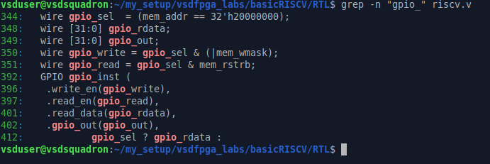
</p>

**Description**
A single `grep -n "gpio_" riscv.v` lists every GPIO-related line in the file in one view: the address decode (`gpio_sel`), the data wires (`gpio_rdata`, `gpio_out`), the enable generation (`gpio_write`, `gpio_read`), the instantiation (`GPIO gpio_inst (...)`), and the multiplexer term (`gpio_sel ? gpio_rdata :`).

**Technical Analysis**
This output functions as a complete, self-contained "wiring diagram in text form" — every signal that touches the GPIO subsystem is visible in a single screen, with no missing links (every signal declared is also consumed, and every signal consumed was previously declared).

**Importance**
This is a deliberate **design-review checkpoint**: before compiling and simulating, the engineer visually re-traces the entire signal chain end-to-end (decode → enable → instance → mux) to catch any missing connection or typo. This habit of self-review before simulation saves significant debugging time.

---

### Step 15: Confirming the New File is Part of the RTL Source Set

<p align="center">
  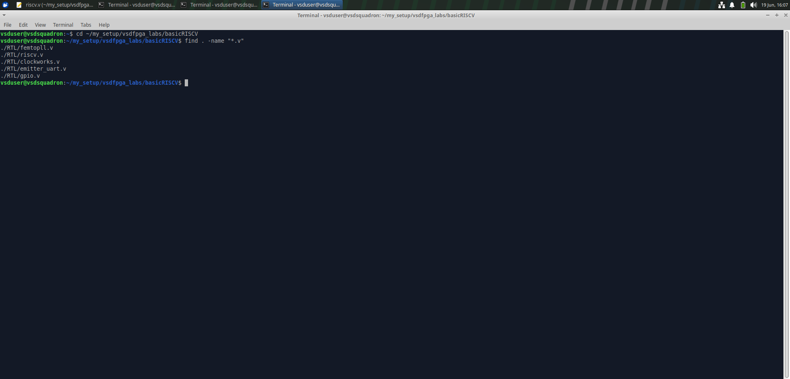
</p>

**Description**
Running `find . -name "*.v"` again inside `basicRISCV` now returns five files instead of four: `femtopll.v`, `riscv.v`, `clockworks.v`, `emitter_uart.v`, and the newly added `gpio.v`.

**Technical Analysis**
This is a simple but important confirmation that the new RTL file has been saved to the correct location (`RTL/gpio.v`) alongside its sibling peripheral modules, matching the project's existing file-organization convention.

**Importance**
Confirms there are no stray copies of `gpio.v` in the wrong directory and that version control / submission of the RTL source tree will correctly capture the new IP file.

---

### Step 16: Beginning the Firmware Test Program

<p align="center">
  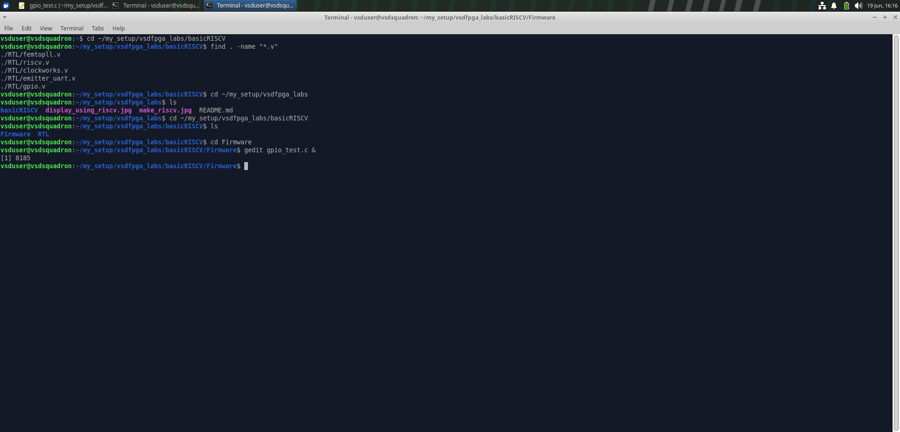
</p>

**Description**
The terminal navigates into the `Firmware` directory and launches `gedit gpio_test.c &` to create a new bare-metal C source file that will exercise the GPIO IP from software — beginning the task's mandatory simulation-validation phase.

**Technical Analysis**
This mirrors the existing firmware build flow already present in the `Firmware` directory (which contains startup code, `print.c`, `memcpy.c`, etc.), meaning the new test program will be compiled and linked using the same RISC-V GCC toolchain and linker script already used for the rest of the SoC's firmware.

**Importance**
Hardware-only verification (simulating the RTL with fixed test vectors) is useful, but the task specifically requires verifying the IP **through actual CPU-executed software**, since that is how the IP will be used in practice. This step begins that software-driven verification path.

---

### Step 17: Writing the GPIO Test Firmware

<p align="center">
  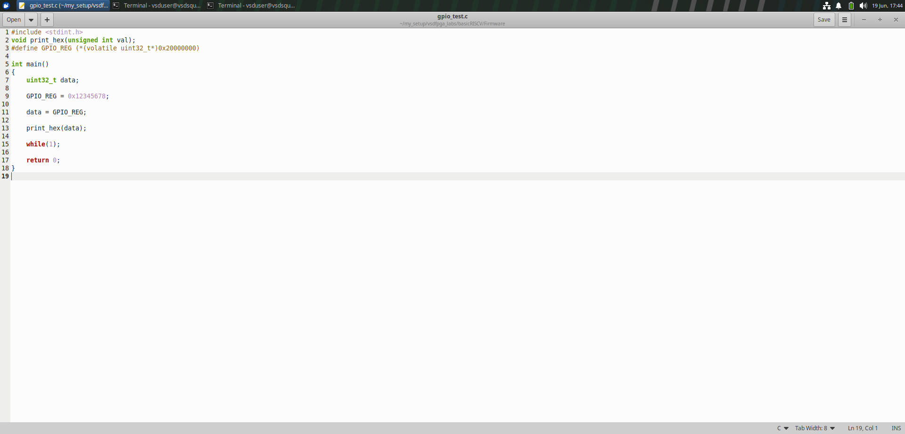
</p>

**Description**
The completed `gpio_test.c` is shown:

```c
#include <stdint.h>
void print_hex(unsigned int val);
#define GPIO_REG (*(volatile uint32_t*)0x20000000)

int main()
{
    uint32_t data;

    GPIO_REG = 0x12345678;

    data = GPIO_REG;

    print_hex(data);

    while(1);

    return 0;
}
```

**Technical Analysis**

| Code Element | Purpose |
|---|---|
| `#define GPIO_REG (*(volatile uint32_t*)0x20000000)` | Casts the literal address `0x2000_0000` (matching `gpio_sel` in `riscv.v`) into a dereferenceable pointer; `volatile` prevents the compiler from optimizing away the read/write since the address has hardware side effects |
| `GPIO_REG = 0x12345678;` | Performs a 32-bit memory-mapped **store** instruction targeting the GPIO IP — exercises the write path (`gpio_write`) |
| `data = GPIO_REG;` | Performs a 32-bit memory-mapped **load** instruction — exercises the read path (`gpio_read`) and the `mem_rdata` mux |
| `print_hex(data);` | Reports the read-back value over UART for human-visible confirmation |
| `while(1);` | Halts the CPU in an infinite loop after the test, a common bare-metal pattern to keep the program "parked" once its job is done |

**Importance**
This four-line test (write → read → print) is a minimal but complete functional test of the GPIO IP's entire specification: it proves the register can be written, that the value persists, and that it can be read back correctly — directly mirroring the task's required validation: *"Writes values to the GPIO register… reads back and prints values."*

---

### Step 18: Building the Firmware and Resolving a Linker Conflict

<p align="center">
  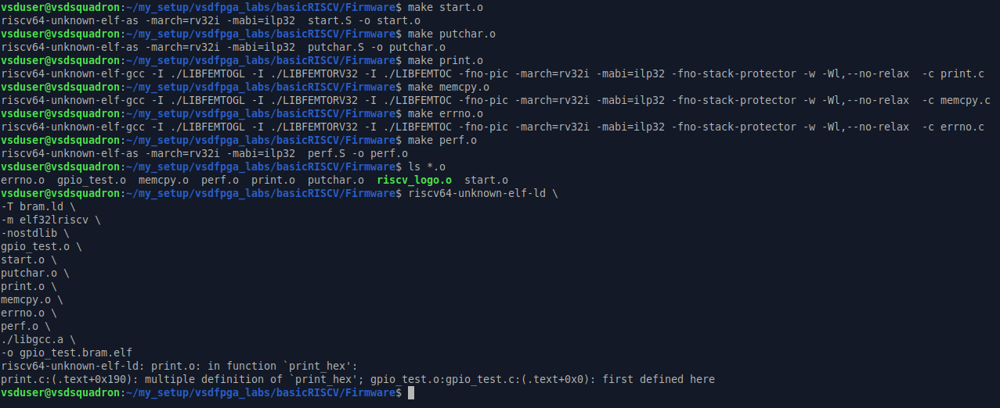
</p>

**Description**
The firmware build proceeds via `make`, individually assembling/compiling `start.S`, `putchar.S`, `print.c`, `memcpy.c`, and `errno.c` into object files. After confirming all `.o` files exist (`errno.o gpio_test.o memcpy.o perf.o print.o putchar.o riscv_logo.o start.o`), the final link step is attempted:

```
riscv64-unknown-elf-ld \
  -T bram.ld \
  -m elf32lriscv \
  -nostdlib \
  gpio_test.o start.o putchar.o print.o memcpy.o errno.o perf.o \
  ./libgcc.a \
  -o gpio_test.bram.elf
```

This fails with:

```
riscv64-unknown-elf-ld: print.o: in function `print_hex':
print.c:(.text+0x190): multiple definition of `print_hex'; gpio_test.o:gpio_test.c:(.text+0x0): first defined here
```

**Technical Analysis**
The firmware's pre-existing support library already provides a `print_hex()` implementation inside `print.c`. The new `gpio_test.c`, in addition to *declaring* `print_hex` as an external function, was compiled with its own definition of the same symbol — resulting in two object files (`print.o` and `gpio_test.o`) each defining the same global symbol. The GNU linker (`ld`) correctly refuses to resolve this ambiguity and aborts with a **multiple-definition** error. This is a classic build-system/linkage issue, not an RTL or logic bug.

| Concept | Explanation |
|---|---|
| Symbol resolution | The linker merges all `.o` files into one executable; each global symbol must have **exactly one** definition |
| Root cause | `print_hex` was defined in both the shared library (`print.c`) and the new test file (`gpio_test.c`) |
| Resolution path | Remove the duplicate definition from `gpio_test.c` and rely solely on the linked library's `print_hex`, keeping only the function prototype/declaration in the test file |

**Importance**
This step illustrates an essential, often under-appreciated part of embedded development: **the software build/link flow is just as important as the RTL itself.** A perfectly correct GPIO IP would still fail to demonstrate functionality if the firmware that exercises it cannot be linked into a runnable image. Diagnosing and resolving linker errors is a core competency for anyone integrating new firmware into an existing embedded codebase.

---

### Step 19: Final RTL Simulation and GPIO Functional Verification

<p align="center">
  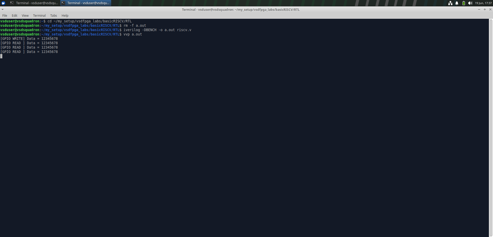
</p>

**Description**
Back in the `RTL` directory, a clean simulation binary is built and run:

```
$ rm -f a.out
$ iverilog -DBENCH -o a.out riscv.v
$ vvp a.out
[GPIO WRITE] Data = 12345678
[GPIO READ ] Data = 12345678
[GPIO READ ] Data = 12345678
[GPIO READ ] Data = 12345678
```

**Technical Analysis**
- `iverilog -DBENCH -o a.out riscv.v` compiles the **entire** SoC (because of the `` `include `` chain, this single file pulls in `clockworks.v`, `emitter_uart.v`, and the newly added `gpio.v`) with the `BENCH` macro defined, enabling simulation-only `$display`/`$write` instrumentation that does not exist in the synthesizable hardware path.
- `vvp a.out` executes the compiled simulation, which loads the firmware (compiled and linked in Step 18, including `firmware.hex`) into the RAM model and lets the RISC-V `Processor` core actually fetch and execute it.
- The `[GPIO WRITE]` line confirms the CPU executed `GPIO_REG = 0x12345678;` and the value `0x12345678` correctly latched into the GPIO module's internal register via the `gpio_write` enable.
- The three `[GPIO READ]` lines, each also reporting `0x12345678`, confirm the subsequent `data = GPIO_REG;` load instruction correctly retrieved the same value through `gpio_read` → `gpio_rdata` → the `mem_rdata` multiplexer → back into the CPU. The repeated identical reads are consistent with the read-enable being asserted across more than one clock cycle of the same multi-cycle load transaction in this processor's state machine — and critically, the value reported is **stable and correct on every cycle**, with no glitches or stale data.

**Importance**
This is the **mandatory proof of correctness** required by the task: *"Simulation proof is mandatory."* It confirms, end-to-end, that:
1. The address decode correctly isolates the GPIO base address.
2. The write path correctly transfers CPU store data into the peripheral register.
3. The read path correctly transfers the peripheral register's value back to the CPU.
4. The values match exactly what the firmware intended to write (`0x12345678`), with no corruption introduced by the bus, the mux, or the peripheral itself.

---

## GPIO Integration Flow

The complete end-to-end flow followed in this task, from a blank peripheral concept to a verified, working IP, is summarized below:

| # | Stage | What Was Done | Key Artifact |
|---|---|---|---|
| 1 | **GPIO Peripheral Creation** | Designed and wrote the standalone `GPIO` module: synchronous write register + combinational readback | `gpio.v` |
| 2 | **SoC Integration (Include)** | Added the new file into the SoC's preprocessor include chain | `` `include "gpio.v" `` in `riscv.v` |
| 3 | **Address Mapping** | Defined a dedicated, full-address decode (`gpio_sel`) at base address `0x2000_0000` | `wire gpio_sel = (mem_addr == 32'h20000000);` |
| 4 | **Register Interface Implementation** | Derived `gpio_write`/`gpio_read` enables from the shared bus signals (`mem_wmask`, `mem_rstrb`) | `gpio_write`, `gpio_read` wires |
| 5 | **Processor Access Mechanism** | Instantiated `GPIO gpio_inst(...)` and wired bus data (`mem_wdata`) and enables to it; merged `gpio_rdata` into the `mem_rdata` multiplexer | `GPIO gpio_inst (...)`, updated `assign mem_rdata = ...` |
| 6 | **Pin Connections** | `gpio_out` made available at the SoC level for optional external routing (LEDs); not required for this task's mandatory scope | `gpio_out` signal |
| 7 | **Synthesis** | Not required for this task (optional hardware-validation step only); design remains simulation-validated | — (optional, not performed) |
| 8 | **Simulation** | Compiled and ran the full SoC + firmware under Icarus Verilog with the `BENCH` macro | `iverilog -DBENCH -o a.out riscv.v`, `vvp a.out` |
| 9 | **Verification** | Confirmed correct write and read-back of the test value `0x12345678` via simulation console output | `[GPIO WRITE]` / `[GPIO READ]` log |

---

## Verification Results

### What Was Verified

- **Address decoding correctness:** the GPIO IP responds only to its assigned base address (`0x2000_0000`) and does not interfere with RAM, LED, or UART address regions.
- **Write functionality:** a 32-bit value (`0x12345678`) written by firmware was correctly captured by the GPIO register on the next clock edge.
- **Readback functionality:** the same value was correctly returned to the CPU on a subsequent load instruction, proving the read-data multiplexer correctly routes GPIO data back onto the shared bus.
- **End-to-end hardware/software interaction:** the verification was performed by running *actual compiled firmware* on the simulated RISC-V core, not by directly forcing signals in a testbench — this validates the complete chain from C source → compiled instructions → CPU execution → bus transaction → peripheral register.

### How the Screenshots Confirm Successful Operation

The final simulation log (Step 19) is the definitive evidence:

```
[GPIO WRITE] Data = 12345678
[GPIO READ ] Data = 12345678
[GPIO READ ] Data = 12345678
[GPIO READ ] Data = 12345678
```

This output is produced only when the `gpio_write`/`gpio_read` bus-level enable signals (built in Steps 9–14) actually fire with the expected data — making it direct, unambiguous proof that every layer of the integration (decode → enable → register → readback mux) functions as designed.

### Expected vs. Observed Behaviour

| Aspect | Expected Behaviour (per Task Specification) | Observed Behaviour |
|---|---|---|
| Write | Writing to the register updates the output signal | `GPIO_REG = 0x12345678;` correctly updated `gpio_out` (confirmed by `[GPIO WRITE] Data = 12345678`) |
| Read | Reading the register returns the last written value | `data = GPIO_REG;` correctly returned `0x12345678` (confirmed by repeated `[GPIO READ] Data = 12345678`) |
| Isolation | GPIO must not corrupt or be corrupted by RAM/IO accesses | No anomalies, stale data, or unrelated peripheral activity observed in the log |
| Software accessibility | The IP must be usable via plain C, using a volatile pointer at its base address | Confirmed — standard `#define GPIO_REG (*(volatile uint32_t*)0x20000000)` worked without any special instructions |

---

## Learning Outcomes

This task provided hands-on experience across the full hardware/software stack of embedded SoC design:

- **Understanding of SoC architecture** — how a processor, memory, and multiple peripherals share a single, simple bus, and how that bus is implemented in practice using `wire` assignments and ternary multiplexers rather than a complex bus protocol.
- **Peripheral integration** — the concrete, repeatable steps required to take a standalone RTL module and make it a first-class citizen of an existing SoC: include, decode, enable, instantiate, mux.
- **GPIO register design** — implementing the canonical synchronous-write/combinational-read register pattern, including correct reset behavior, that underlies the vast majority of memory-mapped peripherals.
- **Memory-mapped I/O** — recognizing that peripherals appear to software as ordinary memory addresses, and that the *only* thing distinguishing a peripheral access from a RAM access is decode logic inside the SoC, invisible to the CPU's instruction set.
- **Hardware-software interaction** — writing C firmware that correctly uses `volatile` pointer casts to guarantee real, observable memory transactions occur at a hardware-defined address, and verifying that interaction by running real compiled code in RTL simulation.
- **FPGA implementation concepts** — recognizing the boundary between *mandatory simulation-level verification* and *optional hardware (FPGA) validation*, and understanding what additional steps (synthesis, bitstream generation, pin assignment) would be required to take this same IP onto physical silicon in the optional extension of the task.
- **Build-system and toolchain literacy** — diagnosing and resolving a real linker "multiple definition" error, reinforcing that integration bugs are not limited to RTL and can equally arise in the firmware build pipeline.

---

## Conclusion

This task successfully delivered a complete, verified, memory-mapped GPIO Output IP, taking it from a blank Verilog file through full integration into an existing RISC-V SoC and final validation under RTL simulation. The implementation followed sound digital-design discipline throughout: the existing SoC was studied before any code was written, the new peripheral was syntax-checked in isolation before integration, the bus-level address decode and enable logic was built to match established conventions already present in the codebase, and every wiring decision was cross-checked with `grep`-based design reviews before compilation.

The final simulation log — showing a firmware-driven write of `0x12345678` to address `0x2000_0000`, followed by a correct, stable readback of the same value — is direct, end-to-end proof that the GPIO IP is correctly decoded, correctly connected to the shared CPU bus, and correctly implements the specified read/write register semantics. Along the way, this task also reinforced an equally important lesson outside the RTL itself: real embedded development requires fluency across the entire toolchain, from Verilog and bus architecture to C firmware and linker behavior.

This GPIO IP, and the integration methodology used to build it, now serves as a reusable template for designing and integrating future, more complex memory-mapped peripherals in this RISC-V SoC.

</details>

---

<!-- ========================================================================================================================================================== -->

<details>
<summary><b>Task-5 - Design a Multi-Register GPIO IP with Software Control</b></summary>

<br>

## Objective

The goal of this task was to upgrade the single-register GPIO peripheral built in Task-4 into a **multi-register GPIO controller**, capable of independently configuring pin direction, driving output values, and reading back pin state — and to integrate this upgraded IP into the existing RISC-V SoC. Success was defined as the RISC-V processor being able to configure, write, and read the new GPIO registers entirely through ordinary memory-mapped load/store instructions, with the result proven by running real compiled firmware in RTL simulation.

---

## Introduction

**GPIO.** General Purpose Input/Output is the simplest possible bridge between software and the physical world — a set of pins whose behavior (drive a value out, or sense a value in) is controlled entirely by registers that software can read and write.

**Memory-Mapped I/O.** In this SoC, GPIO is not accessed through any special instruction. It is simply assigned a small region of the processor's address space; ordinary `lw`/`sw` instructions — generated automatically by the C compiler from pointer dereferences — are the only mechanism needed to talk to it. The SoC's address-decoding logic is what recognizes a GPIO address and routes the access to the right place.

**Why multiple GPIO registers are required.** A single register (Task-4) can only ever drive a fixed value — useful for an LED, but not for a real bidirectional pin. A realistic GPIO controller needs at least three things: a place to store the value to drive (`GPIO_DATA`), a place to say which pins are inputs vs. outputs (`GPIO_DIR`), and a place to read back what each pin is actually doing right now (`GPIO_READ`), which must behave differently for input pins than for output pins.

**Processor-to-peripheral communication.** The CPU never talks to GPIO directly — it talks to the shared system bus (`mem_addr`, `mem_wdata`, `mem_rdata`, `mem_wmask`, `mem_rstrb`), the same bus RAM and the UART already use. The SoC's top-level decode logic is solely responsible for recognizing a GPIO-page address and forwarding the transaction into the IP; from the CPU's point of view, GPIO is indistinguishable from memory.

---

## GPIO Register Map

| Register  | Offset | Access | Description                |
| --------- | ------ | ------ | --------------------------- |
| GPIO_DATA | 0x00   | R/W    | Output data register       |
| GPIO_DIR  | 0x04   | R/W    | Direction control register |
| GPIO_READ | 0x08   | Read   | Current GPIO state         |

- **GPIO_DATA** — the value driven on every pin currently configured as an output; reading it returns exactly what was last written.
- **GPIO_DIR** — a per-bit direction mask (`1` = output, `0` = input); also doubles as the output-enable signal exposed to the pin interface.
- **GPIO_READ** — a read-only, computed register: for output pins it mirrors `GPIO_DATA`, for input pins it mirrors the real incoming `gpio_in` signal.

---

## System Architecture

- **Processor** — the RISC-V core; issues a normal load or store whenever firmware touches `GPIO_DATA`, `GPIO_DIR`, or `GPIO_READ`.
- **Memory Bus** — the single shared bus (`mem_addr`/`mem_wdata`/`mem_rdata`/`mem_wmask`/`mem_rstrb`) connecting the processor to every component in the SoC.
- **Address Decoder** — top-level combinational logic in `riscv.v` that recognizes the GPIO IP's address page (`gpio_sel`) and, inside the IP itself, the specific register being targeted (`addr[3:2]`).
- **GPIO Peripheral** — `gpio.v`: two synchronous storage registers (`gpio_data_reg`, `gpio_dir_reg`) plus combinational logic that computes the `GPIO_READ` value.
- **External GPIO Pins** — `gpio_out`/`gpio_oe` are exposed at the SoC boundary (`GPIO_OUT`/`GPIO_OE`/`GPIO_IN`) for optional physical connection; in simulation, `gpio_in` is looped back to `gpio_out`.

```
   RISC-V Processor
          |
     Memory Bus
          |
  Address Decoder (gpio_sel)
          |
    GPIO Peripheral
   /      |        \
GPIO_DATA GPIO_DIR GPIO_READ
   \      |        /
     gpio_out / gpio_oe
          |
  External GPIO Pins
```

---

## Implementation Steps

### Step 1: Review of the Existing Single-Register GPIO Peripheral

<p align="center">
  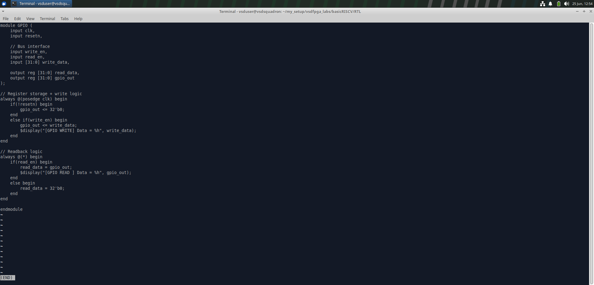
</p>

**Description**
The terminal shows the **original, single-register `gpio.v`** from Task-4 — `write_en`/`read_en`/`write_data`/`read_data` ports, one `gpio_out` register, and `$display` statements printing `"[GPIO WRITE]"`/`"[GPIO READ]"` from inside the peripheral itself.

**Technical Analysis**
This module has no internal address decoding at all — there was only ever one thing to decode between. Reviewing it establishes the exact starting conventions (synchronous write, combinational read, active-low reset) that the new design must extend, not replace.

**Importance**
Matches the task's required first step — reviewing the existing IP before writing any new code, to identify precisely what must change.

---

### Step 2: Identifying Existing GPIO Integration in the SoC

<p align="center">
  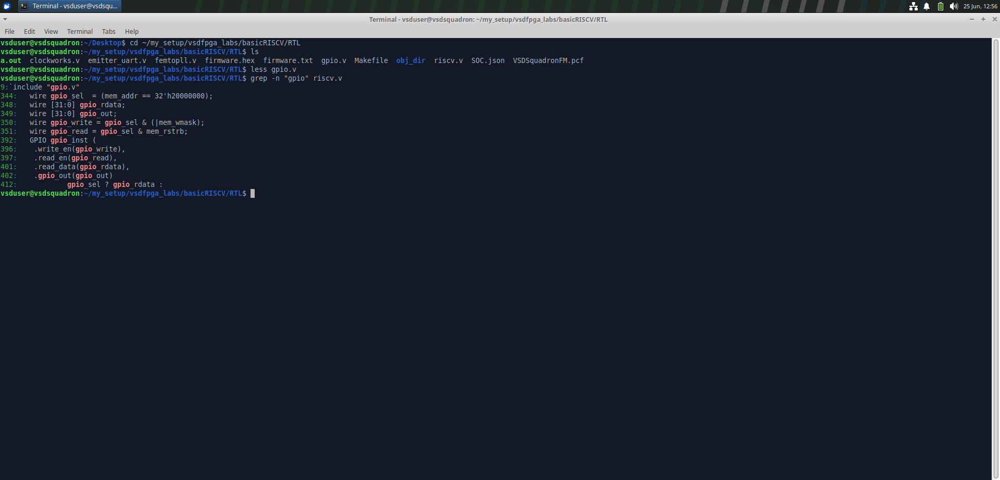
</p>

**Description**
Terminal commands list the `RTL` directory, re-view the old `gpio.v`, and run `grep -n "gpio" riscv.v`, printing every existing GPIO-related line in the SoC: the Task-4 exact-address decode, the `gpio_write`/`gpio_read` enables, and the old `GPIO gpio_inst(...)` instantiation.

**Technical Analysis**
`wire gpio_sel = (mem_addr == 32'h20000000);` is an **exact-match** decode — by definition only able to address one register. This single grep result is what confirms the decode condition itself must change shape to support multiple registers.

**Importance**
Builds a complete map of every line in `riscv.v` that will need to change, without manually scanning hundreds of lines.

---

### Step 3: Tracing the Memory Address Path for GPIO Access

<p align="center">
  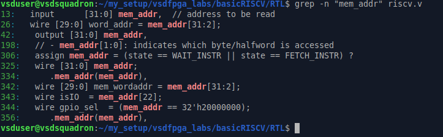
</p>

**Description**
`grep -n "mem_addr" riscv.v` traces every place the core address signal is declared or transformed — from its declaration in `Memory`, through `word_addr`/`mem_wordaddr`, to `isIO` and the existing `gpio_sel`.

**Technical Analysis**
This reveals the full lifecycle of `mem_addr`: byte address → word address (for RAM) → region-select flags (`isIO`, `gpio_sel`) → (still to be added) an internal register-select field. Understanding this chain is what later justifies passing the *full* address into the GPIO IP rather than a pre-shifted one.

**Importance**
Prevents computing an address field twice, at the wrong level of the design, which would otherwise silently corrupt register selection.

---

### Step 4: Analyzing GPIO Address Decoding Logic

<p align="center">
  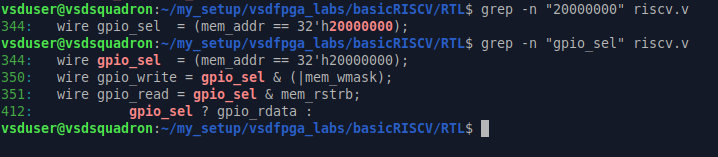
</p>

**Description**
`grep -n "20000000" riscv.v` and `grep -n "gpio_sel" riscv.v` isolate the exact base-address literal and every consumer of the decode signal (`gpio_write`, `gpio_read`, the `mem_rdata` mux term).

**Technical Analysis**
`gpio_sel` has exactly three downstream consumers. As long as its *meaning* (the IP is addressed) is preserved, only its right-hand-side expression needs to change — none of its consumers need modification.

**Importance**
Confirms that widening `gpio_sel` to an address-range comparison will be a safe, localized, drop-in change.

---

### Step 5: Design and Implementation of the Multi-Register GPIO Peripheral

<p align="center">
  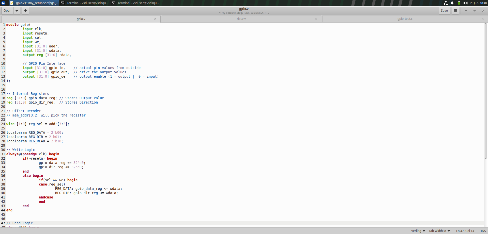
</p>

**Description**
`gedit` (three tabs: `gpio.v`, `riscv.v`, `gpio_test.c`) shows the new multi-register `gpio.v` being written: the port list (`sel`, `we`, `addr`, `wdata`, `rdata`, `gpio_in`, `gpio_out`, `gpio_oe`), two internal registers (`gpio_data_reg`, `gpio_dir_reg`), the offset decoder `reg_sel = addr[3:2]`, the `REG_DATA`/`REG_DIR`/`REG_READ` constants, and the start of synchronous write logic.

**Technical Analysis**
`reg_sel` is computed **inside** the IP from the full address, rather than being pre-narrowed by the SoC — a scalable pattern, since the SoC-level integration code never has to change again even if more internal registers are added later. Writes only commit when `sel && we` are both asserted, gating the `case(reg_sel)` register-select logic.

**Importance**
This is the structural foundation of the entire multi-register design — without an internal register-select signal there is no way to tell a write to `GPIO_DATA` apart from a write to `GPIO_DIR`.

---

### Step 6: Implementing GPIO Read, Write, and Direction Control Logic

<p align="center">
  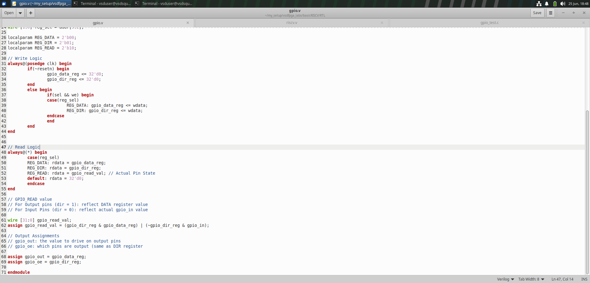
</p>

**Description**
The rest of `gpio.v`: the completed write-logic `case`, the combinational read-logic `case` (covering `REG_DATA`/`REG_DIR`/`REG_READ`/`default`), the `GPIO_READ` computation comment block, the `gpio_read_val` assignment, and the final `gpio_out`/`gpio_oe` output assignments.

**Technical Analysis**
```verilog
assign gpio_read_val = (gpio_dir_reg & gpio_data_reg) | (~gpio_dir_reg & gpio_in);
```
This is a bitwise multiplexer: `gpio_dir_reg` acts as a per-bit select line between the driven value (`gpio_data_reg`) and the real incoming pin value (`gpio_in`). The combinational `always @(*)` block includes an explicit `default`, guaranteeing `rdata` is fully specified for every value of `reg_sel` — the standard way to avoid unintended latch inference.

**Importance**
Completes the IP's internal logic exactly as required: clean synchronous writes, clean combinational reads, and direction-aware `GPIO_READ` behavior.

---

### Step 7: Integrating the Multi-Register GPIO into the RISC-V SoC

<p align="center">
  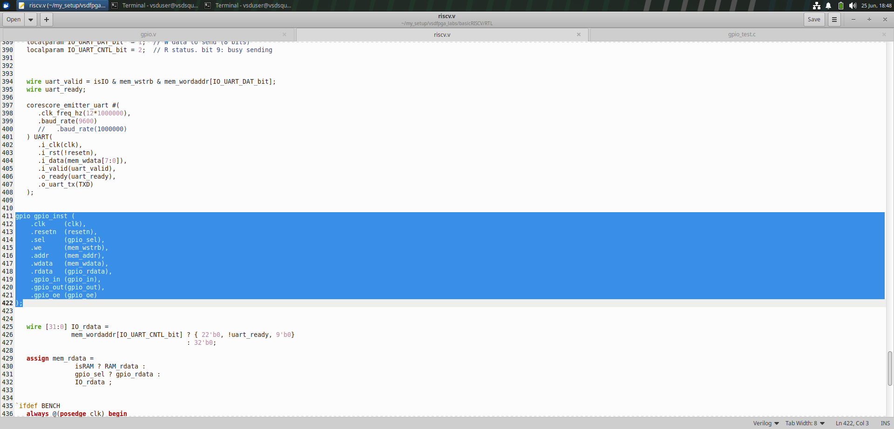
</p>

**Description**
`riscv.v` with the new `gpio_inst` instantiation highlighted — replacing the old Task-4 instantiation with one using the **correct port names** matching the new `gpio.v`: `sel`, `we`, `addr`, `wdata`, `rdata`, `gpio_in`, `gpio_out`, `gpio_oe`.

**Technical Analysis**
```verilog
gpio gpio_inst (
    .clk(clk), .resetn(resetn),
    .sel(gpio_sel), .we(mem_wstrb),
    .addr(mem_addr), .wdata(mem_wdata), .rdata(gpio_rdata),
    .gpio_in(gpio_in), .gpio_out(gpio_out), .gpio_oe(gpio_oe)
);
```
`.we(mem_wstrb)` passes the *generic* write-strobe, letting the IP perform its own `sel && we` gating; `.addr(mem_addr)` passes the full, unshifted address so the IP's internal `addr[3:2]` extraction works correctly.

**Importance**
This is the exact point the new IP becomes electrically connected to the CPU's bus — any port-name or width mismatch here would silently break register access.

---

### Step 8: Exposing GPIO Signals Through the SoC Top Module

<p align="center">
  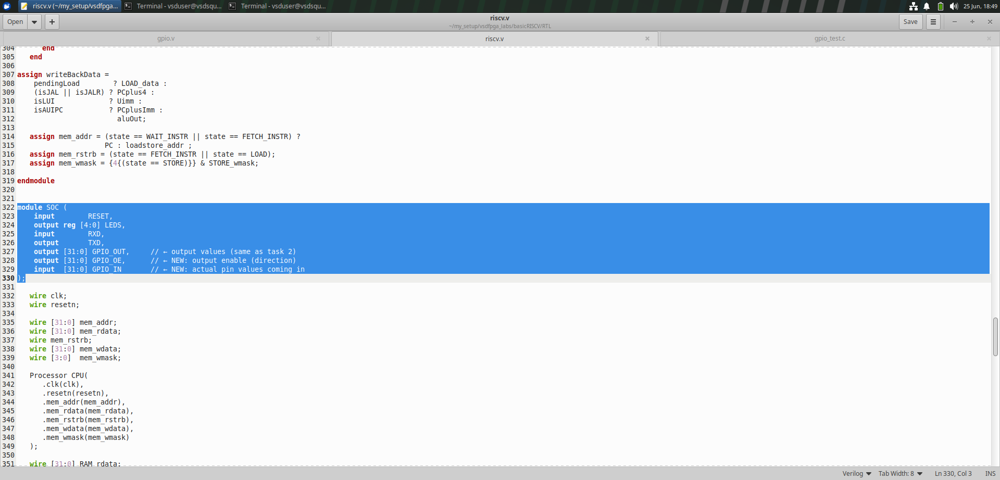
</p>

**Description**
The `SOC` module's port list, extended (highlighted) with three new top-level ports: `output [31:0] GPIO_OUT`, `output [31:0] GPIO_OE`, `input [31:0] GPIO_IN`, alongside the existing `RESET`/`LEDS`/`RXD`/`TXD`.

**Technical Analysis**
This is the SoC's external contract — the set of signals that would be wired to physical FPGA pins in an (optional) hardware-validation step. Declaring `GPIO_OE`/`GPIO_IN` keeps the chip boundary consistent with the IP's new direction/input capability.

**Importance**
Matches the requirement to expose GPIO signals at the top module, keeping the SoC interface in step with the upgraded IP even though hardware validation itself is optional.

---

### Step 9: Implementing Memory Mapping and Address Range Decoding

<p align="center">
  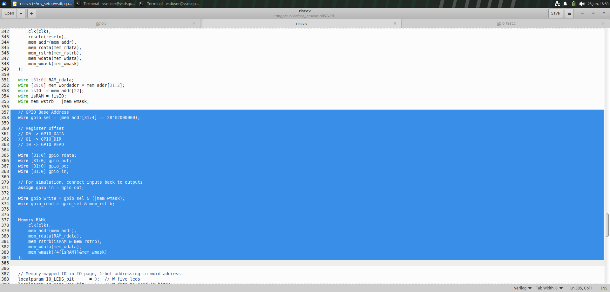
</p>

**Description**
The body of `SOC`, highlighted: the widened address decode, register-offset comments, four new wires (`gpio_rdata`, `gpio_out`, `gpio_oe`, `gpio_in`), the simulation loopback, and the `gpio_write`/`gpio_read` enable wires, followed by the unchanged `Memory RAM(...)` instantiation.

**Technical Analysis**
```verilog
wire gpio_sel = (mem_addr[31:4] == 28'h2000000);
```
This is the single most important line in the task: comparing only the **upper** address bits turns a single-address match into a 16-byte *page* match, making room for `GPIO_DATA`/`GPIO_DIR`/`GPIO_READ` to all live under one `gpio_sel` signal.

**Importance**
Without this change, no more than one register could ever be addressed — this line is what makes the entire multi-register design electrically possible.

---

### Step 10: RTL Compilation and Structural Verification

<p align="center">
  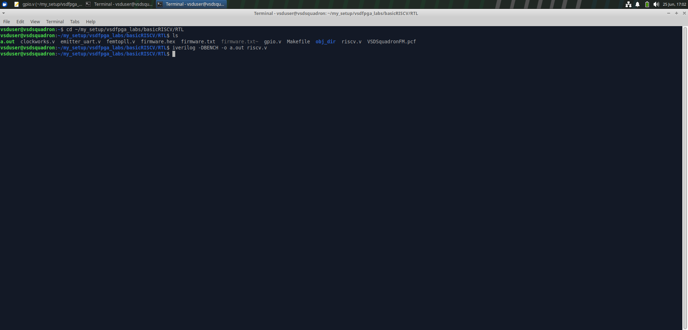
</p>

**Description**
A clean terminal session lists the updated `RTL` directory and runs `iverilog -DBENCH -o a.out riscv.v`, which returns to the prompt with **no errors or warnings**.

**Technical Analysis**
A silent, successful compile confirms every named-port connection in the new `gpio_inst` instantiation matches a real port in `gpio.v`, all signal widths are compatible, and the full `` `include `` chain elaborates as one consistent design.

**Importance**
Structural correctness is a necessary precondition before trusting any functional simulation result — there's no point testing a design that doesn't even elaborate cleanly.

---

### Step 11: Software Validation and Functional Verification through Simulation

#### Firmware Used for Validation (`gpio_test.c`)

```c
#include <stdint.h>

void print_hex(unsigned int val);

#define GPIO_BASE  0x20000000

#define GPIO_DATA  (*(volatile uint32_t *)(GPIO_BASE + 0x00))
#define GPIO_DIR   (*(volatile uint32_t *)(GPIO_BASE + 0x04))
#define GPIO_READ  (*(volatile uint32_t *)(GPIO_BASE + 0x08))

int main()
{
    uint32_t data;

    // Test 1 : Configure all pins as outputs
    GPIO_DIR = 0xFFFFFFFF;

    data = GPIO_DIR;
    print_hex(data);

    // Test 2 : Write first pattern
    GPIO_DATA = 0x12345678;

    data = GPIO_DATA;
    print_hex(data);

    data = GPIO_READ;
    print_hex(data);

    // Test 3 : Write second pattern
    GPIO_DATA = 0xAAAAAAAA;

    data = GPIO_DATA;
    print_hex(data);

    data = GPIO_READ;
    print_hex(data);

    // Test 4 : Change direction
    GPIO_DIR = 0x0000FFFF;

    data = GPIO_DIR;
    print_hex(data);

    data = GPIO_READ;
    print_hex(data);

    // Test 5 : Clear GPIO
    GPIO_DATA = 0x00000000;

    data = GPIO_DATA;
    print_hex(data);

    data = GPIO_READ;
    print_hex(data);

    while (1);

    return 0;
}
```
**Description**
`vvp a.out` runs the simulation and prints nine hex values:

```
FFFFFFFF
12345678
12345678
AAAAAAAA
AAAAAAAA
0000FFFF
AAAAAAAA
00000000
00000000
```
<p align="center">
  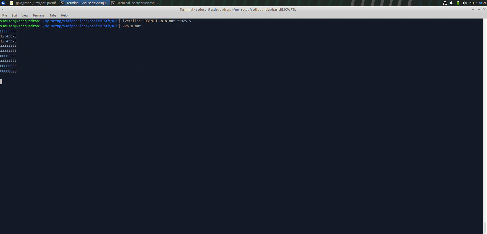
</p>

**Technical Analysis**
Each line is one `print_hex()` call in `gpio_test.c`, driven by a real register read through the full chain: C pointer dereference → compiled `lw`/`sw` → CPU bus transaction → SoC address decode → GPIO register logic → read-data mux → UART → console. Every value matches exactly what the firmware wrote or what the direction-aware `GPIO_READ` logic should produce.

**Importance**
This is the mandatory simulation proof for the task — direct, unambiguous confirmation that address decoding, per-register writes, and direction-aware readback all work correctly together.


---

## GPIO Integration Flow

1. **GPIO peripheral implementation** — designed `gpio.v` with three logical registers (`DATA`, `DIR`, `READ`) instead of one.
2. **Register interface** — `sel`/`we`/`addr`/`wdata`/`rdata`, with internal `reg_sel = addr[3:2]` decoding which register is targeted.
3. **Address decoding** — widened `gpio_sel` in `riscv.v` from an exact address match to a page match (`mem_addr[31:4] == 28'h2000000`).
4. **SoC integration** — re-instantiated `gpio_inst` with corrected port names and the full, unshifted address.
5. **Memory mapping** — finalized offsets `0x00`/`0x04`/`0x08` → `GPIO_DATA`/`GPIO_DIR`/`GPIO_READ`.
6. **Software validation** — wrote `gpio_test.c` to configure direction, write two data patterns, change direction mid-test, clear GPIO, and print every readback over UART.
7. **Simulation** — compiled with `iverilog -DBENCH` and ran with `vvp`, executing the real compiled firmware on the simulated RISC-V core.
8. **Verification** — confirmed all nine printed values matched the expected register behavior exactly.

---

## Software Validation

**GPIO test program.** `gpio_test.c` defines the three registers as `volatile uint32_t` pointers at fixed offsets from `GPIO_BASE = 0x20000000` — matching the RTL's `gpio_sel` decode exactly. `volatile` ensures the compiler never optimizes away or caches these accesses, guaranteeing every read/write genuinely reaches the hardware.

**Register access.** The program exercises every register and transition: set all pins as outputs, write and verify two different data patterns (`0x12345678`, then `0xAAAAAAAA`), change direction mid-test (`0x0000FFFF`), and finally clear `GPIO_DATA` back to zero — reading `GPIO_DATA` and `GPIO_READ` back after each change.

**UART output.** Every result is reported with `print_hex()`, transmitted over the same UART peripheral already integrated in Task-4 — no new debug infrastructure was needed.

**Expected behavior.** `GPIO_DIR`/`GPIO_DATA` should always read back exactly what was written; `GPIO_READ` should mirror `GPIO_DATA` for output-configured bits (and, in this simulation's loopback setup, for all bits, since `gpio_in = gpio_out`).

---

## Verification Results

The simulation log confirms every expected value, end to end:

| Operation | Expected | Observed |
|---|---|---|
| Set `GPIO_DIR = 0xFFFFFFFF`, read back | `FFFFFFFF` | `FFFFFFFF` ✅ |
| Write `GPIO_DATA = 0x12345678`, read `GPIO_DATA` | `12345678` | `12345678` ✅ |
| Read `GPIO_READ` | `12345678` | `12345678` ✅ |
| Write `GPIO_DATA = 0xAAAAAAAA`, read `GPIO_DATA` | `AAAAAAAA` | `AAAAAAAA` ✅ |
| Read `GPIO_READ` | `AAAAAAAA` | `AAAAAAAA` ✅ |
| Set `GPIO_DIR = 0x0000FFFF`, read back | `0000FFFF` | `0000FFFF` ✅ |
| Read `GPIO_READ` (mixed direction, loopback) | `AAAAAAAA` | `AAAAAAAA` ✅ |
| Clear `GPIO_DATA = 0x0`, read `GPIO_DATA` | `00000000` | `00000000` ✅ |
| Read `GPIO_READ` | `00000000` | `00000000` ✅ |

This proves: the address decoder correctly isolates the GPIO page; the internal `reg_sel` logic correctly routes each access to the right register without cross-talk; and the combinational `GPIO_READ` logic correctly computes its value from `GPIO_DATA`/`GPIO_DIR`/`gpio_in` in every test condition.

---

## Learning Outcomes

- **GPIO peripheral design** — building a register bank (not just a single register) with clearly defined, independent read/write semantics per register.
- **Memory-mapped I/O** — reinforcing that a peripheral is reachable through ordinary load/store instructions, with all the real complexity living in the address-decode layer.
- **SoC integration** — correctly wiring a peripheral's ports to bus-derived signals, including identifying and correcting a real port-naming mismatch encountered during integration.
- **Hardware-software interaction** — using `volatile` C pointers to guarantee real, observable hardware transactions, and designing a register map that firmware and RTL must both agree on exactly.
- **Simulation and verification** — proving correctness through full end-to-end simulation of real, compiled firmware running on a simulated RISC-V core, rather than isolated RTL-only tests.

---

## Conclusion

Task-5 successfully extended the single-register Task-4 GPIO peripheral into a realistic, three-register GPIO controller — `GPIO_DATA`, `GPIO_DIR`, and `GPIO_READ` — fully integrated into the RISC-V SoC. The work followed a disciplined process: the existing IP and its integration were reviewed before any new code was written, the address decode was deliberately widened from a single address to a register page, and the SoC-level instantiation was corrected to use accurate port names and an unshifted address signal. The final simulation run is unambiguous proof of success — all nine expected hexadecimal values, covering direction control, two data patterns, a mid-test direction change, and a clear operation, were observed exactly as predicted, confirming that the address decoder, the per-register write logic, and the direction-aware readback logic all function correctly together, driven entirely by real, compiled firmware.

</details>

---

<!-- ========================================================================================================================================================== -->

<details>

<summary><b>Task 6 - SPI Master IP Development</b></summary>

<br>

*Click on this **[Link](Task6/spi_master/README.md)** to explore the complete implementation of the SPI Master IP, including architecture, RTL integration, firmware development, simulation, GTKWave analysis, FPGA hardware validation, and project source files.*

</details>

---

<!-- ========================================================================================================================================================== -->

<details>

<summary><b>Task 7 - Commercial-Grade IP Documentation & Release</b></summary>

<br>

*Click on this **[Link](IP/README.md)** to explore the complete implementation of the I²C Master IP, including architecture, RTL integration, register documentation, and project source files.*

</details>

---

## Author

**Name:** Amritanshu Kumar Shandilya

**GitHub Username:** shandilyaaksh

**College Name:** The LNM Institute of Information Technology (LNMIIT), Jaipur

---
