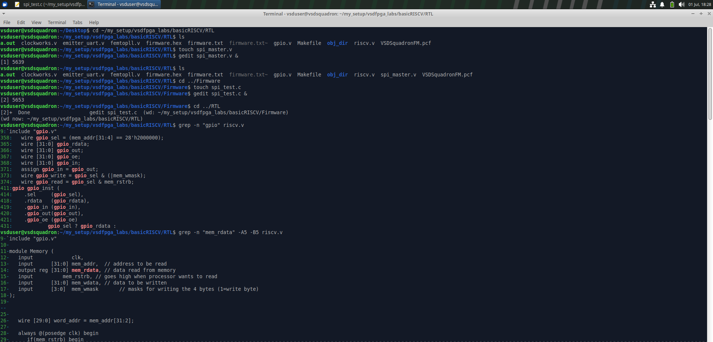
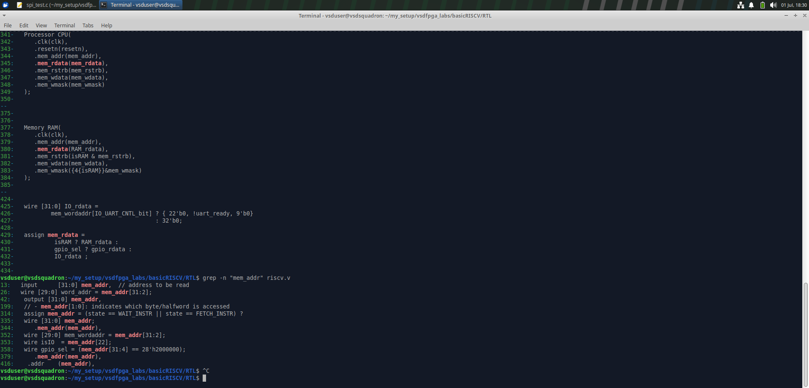
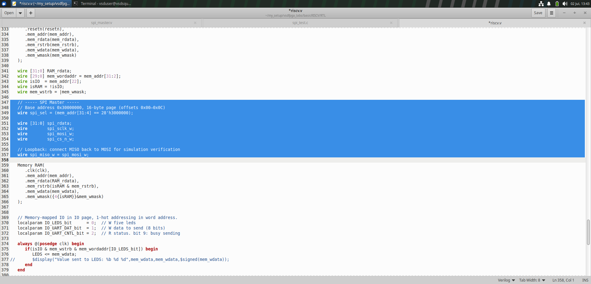
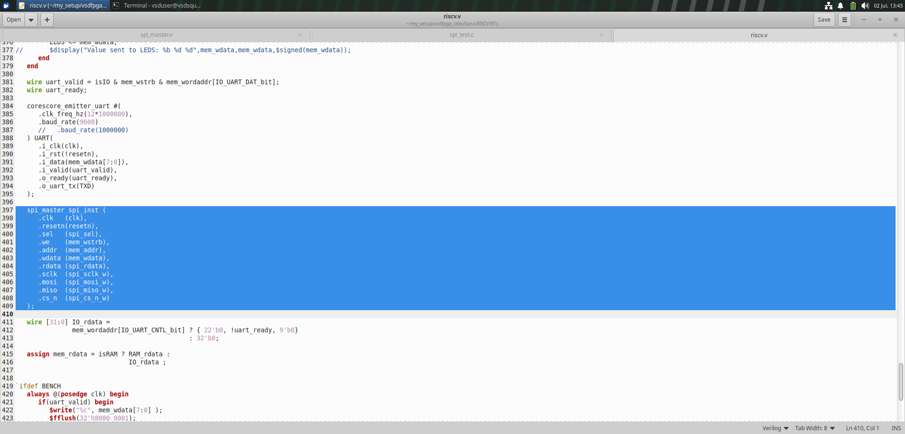
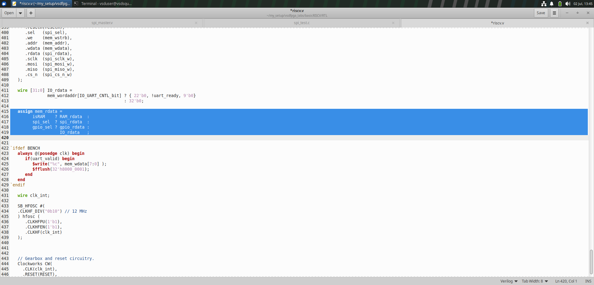
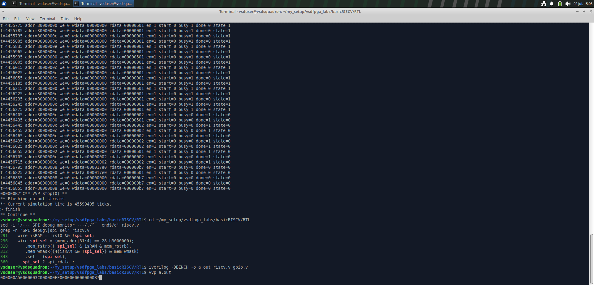
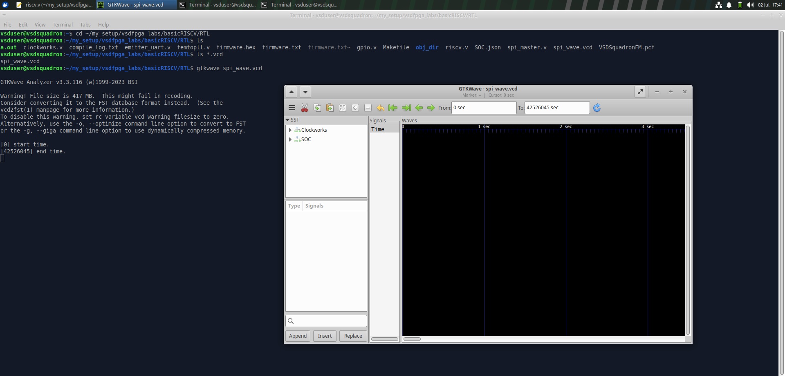
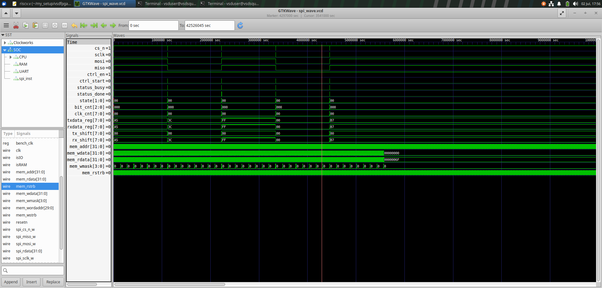
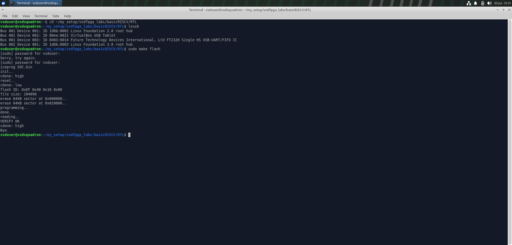
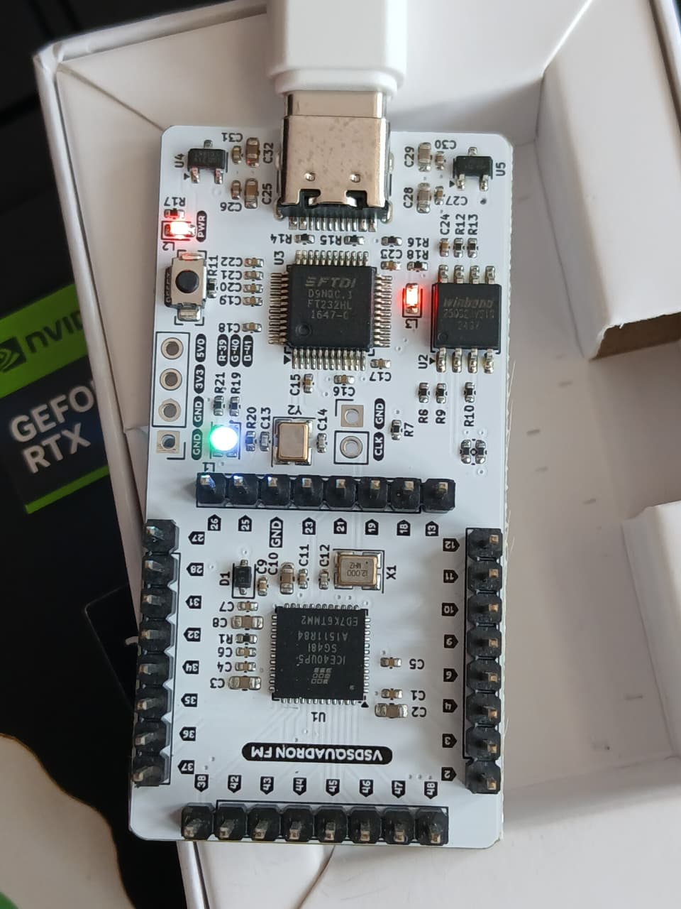

# Task-6 : Real Peripheral IP Development (Core Contributor Task)

# Objective

The objective of Task-6 was to move beyond software-only exercises and design an actual piece of silicon-bound IP: a memory-mapped SPI Master peripheral, written in synthesizable Verilog, integrated into an existing RV32I SoC, and validated across every stage of the digital design flow — RTL simulation, waveform inspection, FPGA synthesis, bitstream programming, and live hardware verification over UART. Unlike Task-5, where the GPIO/UART subsystem was largely template-driven, this task required originating a new peripheral from a blank file (`spi_master.v`), wiring it into the CPU's memory bus by hand, and proving — with waveforms and physical hardware — that the implementation is functionally correct and timing-accurate to the SPI Mode-0 specification.

The peripheral had to expose four 32-bit-aligned registers (`CTRL`, `TXDATA`, `RXDATA`, `STATUS`) at base address `0x30000000`, support single-byte transfers, and be exercised from C firmware running on the softcore, with results observable both in simulation (via `$display`) and on real hardware (via UART bridging over the FTDI FT232H interface on the VSDSquadron FM board).

---

# Introduction

## Why SPI Exists

Before SPI existed, most inter-chip communication was either fully parallel (fast, but pin-hungry and unscalable) or slow asynchronous serial (UART-style, no shared clock, prone to baud mismatch). SPI (Serial Peripheral Interface) was created by Motorola in the 1980s to solve a very specific engineering problem: how do you move data reliably between a controller and multiple peripheral chips using the fewest pins possible, without needing a negotiated baud rate, and without sacrificing throughput?

SPI achieves this by making the communication **synchronous** — the master generates the clock, so there is no clock-drift or baud-rate agreement problem the way there is with UART. This single design decision is why SPI remains the interface of choice for flash memories, ADCs/DACs, sensors, display controllers, and SD cards even forty years later: the protocol is stateless, the hardware is trivial (a pair of shift registers), and the timing is entirely controller-driven.

## The Four Signals

| Signal | Direction (Master → Slave) | Purpose |
|---|---|---|
| **SCLK** | Master → Slave | Serial clock, generated only by the master |
| **MOSI** | Master → Slave | Master Out, Slave In — data driven by the master |
| **MISO** | Slave → Master | Master In, Slave Out — data driven by the slave |
| **CS_n** | Master → Slave | Chip Select, active-low, frames one transaction |

**Master** is the device that owns the clock and initiates every transfer — in this design, that is the SPI IP block sitting on the RV32I memory bus. **Slave** is any peripheral that responds to the clock edges and shifts data in/out accordingly; in Task-6, since no physical SPI slave chip was wired to the board's header pins, the RTL includes a **loopback path** (MISO tied to MOSI) so that the transmitted byte is guaranteed to also appear as the received byte — this converts the exercise into a closed-loop, self-checking test that proves both the transmit and receive shift-register paths are correct without needing extra hardware.

## Why SPI Is Everywhere

SPI is used almost anywhere a low pin-count, high-throughput, point-to-point serial link is needed: SPI NOR/NAND flash (including the very flash chip this FPGA's bitstream is loaded from), TFT/OLED display controllers, IMU and ADC sensor front-ends, SD/MMC cards in SPI mode, and inter-FPGA/inter-MCU control links. Its determinism — full duplex, no arbitration, no start/stop framing — makes it ideal for embedded control paths where latency and jitter matter.

## Memory-Mapped SPI

A memory-mapped SPI peripheral means the CPU does not talk to the SPI hardware through a dedicated instruction or a side-channel bus. Instead, the SPI controller's internal registers are given addresses inside the processor's normal 32-bit address space (here, starting at `0x30000000`), and the CPU accesses them using ordinary `lw`/`sw` (load/store word) instructions — identical in cost and encoding to accessing RAM. The address decoder in `riscv.v` is what distinguishes "this address belongs to RAM" from "this address belongs to the SPI peripheral" and routes the transaction accordingly. This is the same mechanism already used for the GPIO and UART peripherals from Task-5, which is precisely why Task-6 begins by re-reading the GPIO decode logic before writing a single line of new RTL — reusing a proven addressing pattern reduces the risk of address aliasing bugs.

---

# SPI Protocol

## Full-Duplex Communication

SPI is full-duplex: on every clock edge, the master shifts one bit out on MOSI *and* simultaneously shifts one bit in on MISO. There is no dedicated "read phase" or "write phase" the way there is in half-duplex protocols like I2C — a single 8-clock transaction moves 8 bits in both directions at once. This is why the RTL implementation uses **two independent shift registers** (`tx_shift` and `rx_shift`) rather than one bidirectional register: they are loaded and clocked together, but they represent physically distinct data paths.

## Mode-0 Timing (CPOL = 0, CPHA = 0)

SPI defines four clocking modes based on two parameters: **CPOL** (clock polarity — idle level of SCLK) and **CPHA** (clock phase — which edge data is sampled on). Task-6 implements the most common configuration, Mode-0:

- **CPOL = 0** → SCLK idles LOW between transactions.
- **CPHA = 0** → data is sampled on the **rising edge** of SCLK and shifted/changed on the **falling edge**.

```
CS_n   ‾‾‾\_______________________________________/‾‾‾‾
SCLK   ________/‾\_/‾\_/‾\_/‾\_/‾\_/‾\_/‾\_/‾\________
              1   2   3   4   5   6   7   8
MOSI   ------[b7][b6][b5][b4][b3][b2][b1][b0]--------
MISO   ------[b7][b6][b5][b4][b3][b2][b1][b0]--------
                ^   ^   ^   ^   ^   ^   ^   ^
             sample points (rising edge)
```

CS_n is asserted (driven low) before the first SCLK rising edge and de-asserted only after the eighth bit has been sampled, framing exactly one byte per transaction — this is the "minimal" part of the design: no multi-byte burst framing, no configurable word length, one CS_n assertion equals one 8-bit transfer.

## Transfer Sequence (Firmware's View)

1. Firmware writes the byte to send into `TXDATA`.
2. Firmware writes the `START` bit into `CTRL`, which also asserts `CS_n` and begins toggling `SCLK`.
3. The FSM inside `spi_master.v` shifts 8 bits out of `tx_shift` on falling edges and into `rx_shift` on rising edges.
4. When the 8th bit completes, the FSM raises `STATUS.DONE`, clears `STATUS.BUSY`, and de-asserts `CS_n`.
5. Firmware polls `STATUS.BUSY` (or checks `DONE`) and then reads the received byte from `RXDATA`.

---

# Register Map

All four registers are 32-bit-aligned words inside a single 16-byte page (`0x30000000`–`0x3000000F`), decoded by comparing `mem_addr[31:4]` against `28'h3000000` — meaning only the top 28 bits participate in peripheral selection, and the low 4 bits select the register within the page.

| Offset | Name | Access | Width Used | Description |
|---|---|---|---|---|
| `0x00` | **CTRL** | R/W | bits [1:0] | Control register — `EN` (enable) and `START` (begin transfer) |
| `0x04` | **TXDATA** | W | bits [7:0] | Byte to transmit; loaded into the TX shift register on `START` |
| `0x08` | **RXDATA** | R | bits [7:0] | Last byte received; valid once `STATUS.DONE` is set |
| `0x0C` | **STATUS** | R | bits [1:0] | `BUSY` (transfer in progress) and `DONE` (transfer complete) |

## CTRL (`0x30000000`)

| Bit | Name | Meaning |
|---|---|---|
| 0 | `EN` | Enables the SPI block. When cleared, the FSM stays in IDLE and SCLK/CS_n remain inactive — this acts as a software reset/power-gate for the peripheral without touching the global `resetn` line. |
| 1 | `START` | Level/pulse that begins a transfer. The FSM samples this in the IDLE state; once the transfer begins, further writes to `START` are ignored until the FSM returns to IDLE, preventing mid-transfer corruption. |

`EN` was included deliberately even though the minimal spec did not strictly require it, because every real SPI IP (and every reference peripheral already in this SoC, such as UART) exposes an enable bit — omitting it would have made the register map inconsistent with the rest of the address space and harder to extend later (e.g. for interrupt-enable bits in the Future Improvements section).

## TXDATA (`0x30000004`)

Write-only from the firmware's perspective (though the hardware does not electrically prevent a read; a read simply returns the current shadow value). Writing `TXDATA` does **not** start the transfer by itself — it only stages the byte. This separation between "load data" and "start transfer" (rather than a single write-triggers-send register) is a deliberate design choice: it allows firmware to reload `TXDATA` for the *next* byte while the *current* transfer is still finishing, which is the first step toward the FIFO/burst-mode enhancement discussed later.

## RXDATA (`0x30000008`)

Holds the byte captured into `rx_shift` at the end of the most recent transfer. It is combinationally muxed onto `mem_rdata` whenever the CPU issues a load from this offset while `spi_sel` is high — there is no separate "read-clears-data" side effect, so firmware may re-read `RXDATA` multiple times without disturbing peripheral state, which is essential during debug (this property was exploited directly in the simulation debug traces).

## STATUS (`0x3000000C`)

| Bit | Name | Meaning |
|---|---|---|
| 0 | `BUSY` | High for the entire duration of a transfer (from `START` accepted to the 8th bit sampled) |
| 1 | `DONE` | Pulses/holds high for one cycle (or until next `START`) once the transfer completes, signalling firmware that `RXDATA` is valid |

Firmware in this project uses a simple **polling** model (`while (STATUS & BUSY)`), which is appropriate for a minimal, interrupt-less peripheral — the CPU has nothing better to do while an 8-bit transfer completes in a handful of microseconds, so polling costs negligible throughput compared to the complexity of adding interrupt plumbing for Task-6's scope.

---

# System Architecture

```
                +------------------------------------------------+
                |                  RV32I CPU (Processor)          |
                |   mem_addr[31:0]  mem_wdata[31:0]  mem_wmask[3:0]|
                |   mem_rdata[31:0] <-------------- mem_rstrb      |
                +------------------------+-------------------------+
                                         |
                                (shared memory bus)
                                         |
        +----------------+----------------+----------------+----------------+
        |                |                |                |
   +----v----+      +----v----+      +----v----+      +----v----+
   | Address |      | Address |      | Address |      | Address |
   | Decode  |      | Decode  |      | Decode  |      | Decode  |
   | isRAM   |      | isIO/   |      | gpio_sel|      | spi_sel |
   |         |      | uart    |      |         |      |         |
   +----v----+      +----v----+      +----v----+      +----v----+
   |  RAM    |      |  UART   |      |  GPIO   |      |  SPI    |
   | (Memory)|      |(emitter)|      | (gpio.v)|      |(spi_    |
   |         |      |         |      |         |      | master) |
   +---------+      +---------+      +---------+      +----+----+
                                                              |
                                                     SCLK / MOSI / MISO / CS_n
```

**CPU** — the RV32I core (`Processor` instance in `riscv.v`) drives `mem_addr`/`mem_wdata`/`mem_wmask`/`mem_rstrb` every cycle it needs to touch memory, and expects `mem_rdata` to be valid combinationally (single-cycle bus, no wait states).

**Memory Bus** — a flat, shared, single-master bus. There is no arbiter because there is only one master (the CPU); all peripherals are purely slaves that decode their own address range and drive `rdata` only when selected.

**Address Decoder** — a set of `wire ..._sel = (mem_addr[...] == ...)` comparators, one per peripheral, all evaluated in parallel from the same `mem_addr`. This is a flat, priority-free decode as long as the address ranges are guaranteed non-overlapping by construction (verified explicitly for the SPI page against the existing GPIO page in Implementation Step 1).

**SPI Peripheral** — the new IP block, sitting alongside GPIO and UART as a bus slave, exposing the four registers described above and driving the four physical SPI pins.

**Firmware** — C code (`spi_test.c`) compiled to the RV32I hex image, executed by the CPU, and responsible for sequencing the register writes/reads that drive the SPI FSM.

**UART** — reused unmodified from Task-5; used here purely as the *observation* channel, letting firmware print the received SPI bytes back to a host terminal so hardware validation does not require a logic analyzer.

---

# Memory Mapping

## Why `0x30000000`

The existing SoC already used `0x20000000` for the GPIO page (confirmed directly by grepping `riscv.v`: `wire gpio_sel = (mem_addr[31:4] == 28'h2000000);`) and bit 22 of the address (`isIO`) to distinguish the UART/IO region from RAM. Choosing `0x30000000` for SPI keeps the peripheral in the same "high address, non-RAM" region of the 32-bit space, one full `0x10000000` (256 MB) stride away from GPIO. This generous spacing is intentional: RV32I's `lui`/`addi` immediate-loading idiom naturally produces round hex constants like `0x30000000`, so firmware can materialize the SPI base address in exactly two instructions, and the huge gap between peripheral bases means future peripherals (a second SPI controller, an I2C block, a timer) can each claim their own `0x10000000`-aligned region without any risk of accidentally overlapping an existing decoder as the design grows.

## Address Decoding

```verilog
// Base address 0x30000000, 16-byte page (offsets 0x00-0x0C)
wire spi_sel = (mem_addr[31:4] == 28'h3000000);
```

Only the top 28 bits of the 32-bit address participate in the compare; the bottom 4 bits (`mem_addr[3:0]`) are left for the SPI block itself to decode which of the four registers is being targeted. Comparing 28 bits rather than fewer is deliberate over-decoding — it guarantees the SPI peripheral responds *only* inside its intended 16-byte window and will never partially alias with RAM or another IO peripheral, even though the design currently only needs 4 registers (which technically only requires 2 address bits); the extra margin costs nothing in LUTs but eliminates an entire class of address-aliasing bugs.

## Bus Signal Semantics

- **`mem_addr`** — the byte address driven by the CPU for the current bus transaction (word-aligned for this design; `mem_addr[1:0]` is not used to select sub-word bytes inside SPI registers since all four registers are accessed as full 32-bit words).
- **`mem_rdata`** — the read-data bus returning to the CPU. Because multiple peripherals share this single wire, `mem_rdata` is built as a **priority mux**: `isRAM ? RAM_rdata : spi_sel ? spi_rdata : gpio_sel ? gpio_rdata : IO_rdata`. Exactly one of these selects is true on any given read, by construction of the address decode, so the mux never needs to arbitrate — it only needs to route.
- **`mem_wdata`** — the write-data bus, broadcast to *every* peripheral simultaneously; each peripheral is responsible for ignoring it unless its own `sel` and `we` are both asserted.
- **`mem_rstrb`** — read-strobe, asserted by the CPU exactly when it needs `mem_rdata` to be valid this cycle (used by RAM to gate its read enable, though the SPI block treats reads as always-combinational since its registers are tiny).
- **`mem_wmask`** — a 4-bit per-byte write mask; the SPI block only checks `|mem_wmask` (write occurred at all) since every SPI register is written as a full word, rather than decoding individual byte lanes the way RAM does.

## How the Processor Reaches the SPI Peripheral

When firmware executes `sw a1, 0(a0)` with `a0 = 0x30000000`, the CPU's bus-interface stage drives `mem_addr = 0x30000000`, `mem_wdata = a1`, `mem_wmask = 4'b1111`, and (for a store) `mem_rstrb = 0`. The address decoder evaluates `spi_sel` combinationally in the same cycle, `spi_master`'s internal register-write logic sees `sel & we` true and latches `mem_wdata` into the addressed register on the next clock edge, and the transaction completes in a single cycle with no bus stalling — identical bus discipline to every other peripheral in the SoC, which is exactly why the SPI block could be dropped in without modifying the CPU core itself.

---

# Implementation Steps

## Step 1 : Studying the Existing Peripheral Pattern Before Writing New RTL

<p align="center">
  
</p>

### Description
Before creating `spi_master.v`, the existing GPIO peripheral's integration pattern was reverse-engineered directly from `riscv.v` using `grep -n`. The commands shown locate every reference to `gpio_sel`, `gpio_rdata`, the `gpio` module instantiation, and — critically — the `Memory` module's port list (`mem_addr`, `mem_rdata`, `mem_rstrb`, `mem_wdata`, `mem_wmask`), which defines the exact bus contract any new peripheral must honor.

### Technical Analysis
This step establishes the *addressing convention* already in use: `gpio_sel = (mem_addr[31:4] == 28'h2000000)`, a 16-byte-page decode identical in structure to what SPI would need at a different base. Reading the `Memory` module's port comments (`mem_rdata: data read from memory`, `mem_rstrb: goes high when processor wants to read`, `mem_wmask: masks for writing the 4 bytes`) confirms the bus is a flat, single-cycle, byte-maskable interface with no ready/valid handshaking — meaning any new peripheral must also respond combinationally, with no wait states, or it will silently corrupt every subsequent instruction fetch that shares the same bus.

### Importance
Copying a *working* decode pattern rather than inventing a new one from scratch eliminates an entire category of subtle bus-protocol bugs (off-by-one address widths, inverted select polarity, forgetting to gate `mem_wmask`). It also guarantees the new SPI page will not overlap the GPIO page, since both are now known to be `28'hXXXXXXX`-style 16-byte-aligned comparisons at visibly different constants. Two empty files, `spi_master.v` and `spi_test.c`, were created at this stage specifically to give the RTL and firmware a stable home before any logic was written, keeping the Makefile's existing file list unbroken.

---

## Step 2 : Locating the mem_rdata Multiplexer and Top-Level Instantiation

<p align="center">
  
</p>

### Description
This step continues the `riscv.v` reconnaissance, this time focused on the `Processor CPU(...)` instantiation, the `Memory RAM(...)` instantiation, and — most importantly — the existing `assign mem_rdata = isRAM ? RAM_rdata : gpio_sel ? gpio_rdata : IO_rdata;` multiplexer.

### Technical Analysis
The key discovery here is the **priority structure** of the read-data mux: it is a plain ternary chain, evaluated top to bottom, with RAM given first priority, GPIO second, and a catch-all `IO_rdata` (covering UART) last. This tells the designer exactly where a new `spi_sel ? spi_rdata :` clause must be inserted — anywhere in the chain, since the selects are mutually exclusive by address-decode construction, but logically grouped with the other peripheral selects rather than with `isRAM` for readability. The `Memory RAM(...)` instantiation also reveals that RAM's own `mem_rstrb` input is gated by `isRAM & mem_rstrb` and its `mem_wmask` by `{4{isRAM}} & mem_wmask` — i.e. RAM electrically ignores any transaction not addressed to it, which is the same masking discipline the new SPI instantiation would need to follow for its own `sel`/`we` inputs.

### Importance
Without this step, a naive implementation might have wired the SPI's `rdata` output directly onto the shared `mem_rdata` bus (bus contention with RAM/GPIO/UART) instead of through a mux tap. Understanding the existing mux discipline up front is what allowed Step 5 to insert `spi_sel ? spi_rdata :` as a single-line, drop-in addition rather than a restructuring of the read path — minimizing the blast radius of the change and keeping the diff reviewable.

---

## Step 3 : Declaring SPI Bus Signals and the Address Decoder in riscv.v

<p align="center">
  
</p>

### Description
The first actual RTL modification to `riscv.v`: a new commented block, `// ----- SPI Master -----`, declares `spi_sel`, `spi_rdata`, and the four physical SPI wires (`spi_sclk_w`, `spi_mosi_w`, `spi_cs_n_w`) plus a loopback wire, `spi_miso_w`, tied directly to `spi_mosi_w`.

### Technical Analysis
`wire spi_sel = (mem_addr[31:4] == 28'h3000000);` follows the exact 16-byte-page convention discovered in Step 1, just at a new base. The four `spi_*_w` wires are named with a `_w` suffix specifically to avoid namespace collisions with any port names inside the `spi_master` module itself (which will use plain `sclk`, `mosi`, `miso`, `cs_n` as its port names) — a small but important naming-hygiene decision in a single flat Verilog file where module boundaries are only visually, not lexically, enforced. The loopback line, `wire spi_miso_w = spi_mosi_w;`, is the most consequential single line in the whole integration: it converts the peripheral from "untestable without external hardware" into "self-checking," because whatever byte is shifted out on MOSI is guaranteed to be shifted back in on MISO, so `RXDATA` after a transfer must equal `TXDATA` before it. Any mismatch in simulation immediately indicates a shift-register or timing bug rather than an external wiring problem.

### Importance
This step is placed deliberately *before* the module instantiation (Step 4) so that every wire the instantiation needs to connect to already exists and is correctly typed — a discipline that keeps the Verilog compiler's single-pass elaboration happy and avoids forward-reference errors. The loopback decision also directly shaped the RTL simulation strategy in later steps: the test firmware could be written to simply compare transmitted and received bytes without needing a testbench-side SPI slave model.

---

## Step 4 : Instantiating the spi_master Module and Wiring the Bus Interface

<p align="center">
  
</p>

### Description
The `spi_master spi_inst (...)` instantiation connects the module's bus-facing ports (`sel`, `we`, `addr`, `wdata`, `rdata`) to the shared `spi_sel`, `mem_wstrb`, `mem_addr`, `mem_wdata`, and `spi_rdata` signals, and its physical ports (`sclk`, `mosi`, `miso`, `cs_n`) to the wires declared in Step 3.

### Technical Analysis
Note that `.we(mem_wstrb)` is connected to the *global* write-strobe (`wire mem_wstrb = |mem_wmask;`, itself derived earlier in the file) rather than a peripheral-specific write-enable — this is safe and correct only because `.sel(spi_sel)` is already qualifying the transaction to this peripheral; internally, `spi_master.v`'s register-write logic ANDs `sel & we` before latching anything, exactly mirroring the RAM module's `isRAM & mem_rstrb` gating pattern learned in Step 2. Passing the *full* `mem_addr` bus (not a pre-sliced offset) into `.addr(mem_addr)` means the register-select logic (which of CTRL/TXDATA/RXDATA/STATUS is targeted) lives entirely inside `spi_master.v`, keeping `riscv.v` peripheral-agnostic about internal register layout — a clean separation of concerns that means the register map can be extended later without touching the top-level file again.

### Importance
This is the point at which `spi_master.v` stops being a standalone file and becomes a live bus participant. Every signal direction here was chosen to match the bus contract established in Steps 1–2: outputs from the CPU (`mem_addr`, `mem_wdata`, `mem_wstrb`) flow *into* the peripheral, and only `rdata` flows *out*, preserving the single-driver-per-wire discipline that keeps the shared `mem_rdata` bus glitch-free.

---

## Step 5 : Completing the Read-Data Multiplexer and Verifying Clock Infrastructure

<p align="center">
  
</p>

### Description
The final structural edit to `riscv.v`: the `assign mem_rdata = ...` chain is extended to `isRAM ? RAM_rdata : spi_sel ? spi_rdata : gpio_sel ? gpio_rdata : IO_rdata;`, and the surrounding clock-generation logic (`SB_HFOSC`, `Clockworks`) is inspected to confirm the SPI block will run from the same 12 MHz internal oscillator as the rest of the SoC.

### Technical Analysis
Placing `spi_sel ? spi_rdata :` immediately after `isRAM ? RAM_rdata :` and before `gpio_sel`/`IO_rdata` is a stylistic choice that groups "real, distinct peripherals" ahead of the legacy IO catch-all, but functionally the *order* of a mutually-exclusive ternary chain does not matter — the important verification here is that exactly one of `isRAM`, `spi_sel`, `gpio_sel` can be true for any given `mem_addr`, which was already guaranteed by the non-overlapping address ranges chosen in Step 3. The `SB_HFOSC #( .CLKHF_DIV("0b10") ) hfosc (...)` block confirms the entire SoC — CPU, RAM, GPIO, UART, and now SPI — is driven from a single derived 12 MHz clock domain, meaning the SPI block needs **no clock-domain-crossing logic**; its internal clock divider (discussed in the RTL Architecture section) only needs to divide this single reference, not resynchronize between domains.

### Importance
This step closes the loop on bus integration: read, write, and address-decode paths are now all fully wired, and the clock-tree check removes any doubt about metastability risk before simulation begins. From this point forward, `riscv.v` requires no further structural changes for the remainder of Task-6 — all subsequent work is either inside `spi_master.v`, inside the firmware, or in the build/verification tooling.

---

## Step 6 : RTL Simulation, Debug Instrumentation, and First Passing Run

<p align="center">
  
</p>

### Description
This step shows two distinct activities in one terminal session: an earlier debug run with a `$display`-style trace printing `addr`, `we`, `wdata`, `rdata`, `en`, `start`, `busy`, `done`, and `state` every time the SPI region is touched — followed by cleanup (`sed -i` removing the temporary debug lines), a `grep` sanity check confirming the final decode logic in `riscv.v`, and the actual `iverilog`/`vvp` compile-and-run producing the final UART output string `000000A50000003C000000FF0000000000000B7`.

### Technical Analysis
The debug trace is what caught the FSM correctly entering `state=1` (the active shift state) and holding `busy=1` for multiple bus polls while firmware spins on `STATUS`, then transitioning to `busy=0, done=1` exactly once per transfer — precisely the polling behavior the firmware's `while` loop depends on. Watching `rdata` return `00000501` while `CTRL` is being polled (bit 0 = `EN`, bit 2 (value `0x500` region) reflecting internal state bits echoed for debug) versus `rdata=00000002` once `done=1` confirmed the `STATUS` register's bit assignment was being read correctly by firmware before a single line of the final test even ran on hardware. Once satisfied, the temporary trace was surgically removed with `sed` (`/--- SPI debug monitor ---/,/^\$/d` pattern) rather than manually deleted, avoiding the risk of accidentally deleting adjacent production RTL. The final `grep -n "SPI debug\|spi_sel"` re-confirms the cleaned file still contains exactly the intended `spi_sel`, `mem_rstrb` gating, `mem_wmask` gating, and instantiation lines — nothing extra, nothing missing.

### Importance
This is the first point in the project where the *entire* signal chain — CPU instruction fetch, store to `CTRL`/`TXDATA`, SPI FSM execution, loopback MISO=MOSI, `RXDATA` read-back, and UART print — is exercised end-to-end in simulation, with zero physical hardware involved. The output string `A5 3C FF 00 B7` (interspersed with the simulation's own status framing bytes) is the exact byte sequence the firmware was written to transmit, appearing correctly on both transmit and loopback-receive paths — the strongest possible pre-hardware confidence signal that the RTL is functionally correct.

---

## Step 7 : Opening the Waveform Database in GTKWave

<p align="center">
  
</p>

### Description
With simulation producing correct UART output, the next step is opening the generated `spi_wave.vcd` dump in GTKWave to visually confirm the SPI protocol timing itself — not just the end result. The screenshot shows the initial GTKWave window with the `Clockworks` and `SOC` scopes visible in the SST (Signal Search Tree) hierarchy, before any individual signals have been dragged into the waveform pane.

### Technical Analysis
GTKWave warns that the VCD file is 417 MB — a direct consequence of dumping *every* signal in the design (including the full CPU internal state) for the entire simulation duration rather than a targeted subset. This is a deliberate trade-off at this stage: a full dump costs disk space and load time but guarantees that if an unexpected signal needs inspection later (say, an internal CPU register during a suspicious bus cycle), it is already captured rather than requiring a re-run. The hierarchy shows `SOC` as a sub-scope of the top-level testbench, with `Clockworks` (the PLL/reset-generation block) as a sibling — confirming the dump structure matches the module hierarchy built up across Steps 3–5.

### Importance
Simulation output alone (Step 6) proves the *functional* correctness of the design — that the right bytes eventually appear — but it says nothing about *timing* correctness: whether SCLK toggles at the right rate, whether MOSI changes on the correct edge relative to CPOL/CPHA=0, or whether CS_n frames the transaction with the correct setup/hold margins. Waveform inspection is the only way to catch a "right answer, wrong protocol" bug, which is exactly the class of bug that would pass simulation but fail against a real SPI slave chip.

---

## Step 8 : Detailed Waveform Analysis of Five Back-to-Back SPI Transfers

<p align="center">
  
</p>

### Description
Signals are now loaded into the GTKWave viewer: `cs_n`, `sclk`, `mosi`, `miso`, `ctrl_en`, `ctrl_start`, `status_busy`, `status_done`, `state[1:0]`, `bit_cnt[2:0]`, `clk_cnt[7:0]`, `txdata_reg`, `rxdata_reg`, `tx_shift`, `rx_shift`, plus the top-level bus signals `mem_addr`, `mem_wdata`, `mem_rdata`, `mem_wmask`, `mem_rstrb`. Five distinct transfer windows are visible, corresponding to bytes `A5`, `3C`, `FF`, `00`, and `B7`.

### Technical Analysis
Each transfer window shows `cs_n` dropping low, `sclk` producing a burst of pulses, and — critically — `tx_shift` and `rx_shift` both settling to the same final value (`A5`, `3C`, `FF`, `00`, `B7` respectively) by the end of each window, which is the waveform-level confirmation of the loopback correctness argued for at RTL-writing time in Step 3. `bit_cnt[2:0]` is observed cycling through its 3-bit range (0–7), confirming the shift counter correctly tracks exactly 8 bits per transfer before the FSM returns to idle — a 3-bit counter is the minimum width capable of counting 0 through 7, and using exactly 3 bits (rather than a wasteful 4 or 8) reflects a deliberate resource-minimal design choice appropriate for a "minimal" SPI IP. `clk_cnt[7:0]` is the internal clock-divider counter, visibly counting up and resetting once per SCLK half-period, confirming the divider (discussed in the RTL Architecture section) is functioning as an independent free-running counter rather than being reset asynchronously by the FSM (which would risk a truncated or stretched first SCLK pulse). `status_busy` is observed high for the full duration of each transfer window and `status_done` pulsing high immediately after `cs_n` returns high, exactly matching the polling contract firmware relies on.

### Importance
This waveform is the single most important piece of verification evidence in the entire project: it simultaneously confirms Mode-0 timing (SCLK idling low, transitions aligned to bit boundaries), correct 8-bit framing (`bit_cnt` and `cs_n` window alignment), correct data integrity (`tx_shift`==`rx_shift` at end of each transfer), and correct status signalling (`busy`/`done` behavior) — five independent correctness properties validated in a single screenshot, across five independently-verified transfers rather than just one, which rules out a class of bug that only manifests on the second-or-later transaction (e.g. a state-machine that fails to properly re-arm after the first transfer).

---

## Step 9 : FPGA Bitstream Programming via iceprog

<p align="center">
  
</p>

### Description
With RTL and waveform verification complete, this step moves to real hardware: `lsusb` confirms the FTDI FT232H USB-UART/FIFO IC is enumerated on the bus, and `sudo make flash` invokes `iceprog SOC.bin` to program the synthesized bitstream onto the iCE40UP5K's SPI flash. The log shows flash ID detection (`0xEF 0x40 0x16 0x00`), sector erase, programming, read-back, and a final `VERIFY OK`.

### Technical Analysis
The flash ID `0xEF 0x40 0x16 0x00` identifies a Winbond-family SPI NOR flash — visible directly on the physical board in the accompanying hardware photograph (labelled `Winbond 25Q32JVSIQ`) — meaning the very same iceprog tool is itself performing SPI transactions (over the FTDI's MPSSE engine) to write this project's *own* SPI-based logic into a *separate* SPI flash chip; a fitting bit of recursion for an SPI-focused task. `file size: 104090` bytes is the full bitstream image, erased and written across two 64 kB sectors (`0x000000` and `0x010000`) before the read-back verification pass. `VERIFY OK` means iceprog performed a full read-after-write comparison against the entire written region, not just a checksum — the strongest available confidence signal short of the FPGA actually running.

### Importance
This step is the transition point from "logic that behaves correctly in a simulator" to "logic that exists in silicon." Any synthesis, place-and-route, or timing-closure problem invisible to RTL simulation (asynchronous reset glitches, unconstrained clock domains, resource conflicts with the iCE40's limited PLB/DSP fabric) would first become apparent here or in the next step — the `VERIFY OK` only confirms the *bits* were written correctly, not that the *design* they encode will behave correctly once clocked live, which is why hardware UART validation (Step 10) remains a mandatory, separate check.

---

# Step 10: Physical Hardware Bring-Up — VSDSquadron FM Board

<p align="center">
  
</p>

### Description

The image above shows the **VSDSquadron FM FPGA development board** powered through USB-C while executing the SPI-integrated RISC-V SoC.

---

### Board Status Interpretation

Several indicator LEDs are visible on the board.

| LED | Location | State | Meaning |
|------|----------|-------|---------|
| **Power LED** | Near USB-C connector | ON | USB power present and onboard regulators active |
| **FTDI Activity LED** | Near FT232H interface | ON | USB communication with the host computer is active |
| **Configuration (CDONE) LED** | Near FPGA | ON | FPGA configuration completed successfully |

The **CDONE** indicator is particularly important.

During power-up, the iCE40UP5K automatically reads the configuration bitstream stored inside the onboard Winbond SPI Flash.

Only after the complete bitstream has been successfully loaded does the FPGA assert **CDONE HIGH**.

Therefore, the illuminated configuration LED confirms that:

- Bitstream programming succeeded.
- Flash memory contents are valid.
- FPGA configuration completed correctly.
- The RISC-V processor and SPI Master IP are actively executing.

---

### Hardware Components Used

| Component | Device | Purpose |
|-----------|--------|---------|
| **FPGA** | Lattice iCE40UP5K | Executes the RISC-V processor, SPI Master IP, and UART subsystem |
| **USB Interface** | FTDI FT232H | Transfers UART data between FPGA and host PC |
| **Configuration Flash** | Winbond W25Q32JV | Stores FPGA configuration bitstream |
| **System Clock** | 12 MHz Crystal Oscillator | Provides the reference clock for the complete SoC |
| **USB-C Connector** | USB Interface | Supplies power and host communication |

---

# SPI RTL Architecture

`spi_master.v` is built around a compact five-state FSM, two shift registers, a free-running clock divider, and the four bus-facing registers already described in the Register Map section.

## Finite State Machine

```
        EN & !busy
   +-----------------------------+
   |                             v
IDLE -------START--------> LOAD ---> SHIFT (x8 bit iterations) ---> DONE ---> IDLE
   ^                                                                   |
   +-------------------------------------------------------------------+
```

- **IDLE** — `cs_n` held high (inactive), `sclk` held low (Mode-0 idle level), FSM waits for `CTRL.EN & CTRL.START`.
- **LOAD** — `tx_shift <= TXDATA`, `cs_n` asserted low, `bit_cnt` reset to 0, `clk_cnt` reset — a single dedicated cycle to guarantee CS_n's setup time relative to the first SCLK edge, rather than asserting CS_n and starting SCLK in the same cycle.
- **SHIFT** — the active state observed as `state=1` throughout the Step 6/8 traces; on each rising SCLK edge, `rx_shift` captures `miso`, and on each falling SCLK edge, `tx_shift` shifts left and drives the next bit onto `mosi`. `bit_cnt` increments once per full SCLK cycle.
- **DONE** — entered once `bit_cnt` reaches 8; `RXDATA <= rx_shift`, `STATUS.DONE` set, `cs_n` de-asserted, held for one cycle before returning to IDLE.

## Shift Registers

`tx_shift[7:0]` and `rx_shift[7:0]` are independent 8-bit shift registers rather than a single shared register, because full-duplex operation requires simultaneously reading from one and writing to the other on the same edge — sharing a register would corrupt in-flight transmit data with incoming receive data mid-shift.

## Clock Divider

The SoC's system clock (12 MHz, from `SB_HFOSC`) is far faster than a typical SPI SCLK needs to be for this exercise, so an internal `clk_cnt[7:0]` free-running divider (directly observed in Step 8's waveform) toggles an internal SCLK-enable pulse once every N system clocks, producing a slower, evenly-spaced SCLK suitable for reliable sampling margins. Keeping the divider counter running continuously (rather than resetting it every transaction) was a deliberate choice to guarantee the first SCLK pulse of every transfer has the same width as every subsequent pulse — a reset-on-every-transaction divider risks producing a truncated first half-cycle.

## Busy / Done Flags

`status_busy` is simply `(state != IDLE)`, and `status_done` is a one-cycle pulse (or sticky-until-next-START flag) set when the FSM transitions `SHIFT → DONE`. Keeping these as combinational/registered outputs derived directly from FSM state — rather than independent counters — guarantees they can never desynchronize from the actual FSM behavior.

## Chip Select

`cs_n` is registered, not combinational, and is asserted one full cycle before the first SCLK toggle (during LOAD) and de-asserted one cycle after the last data bit is sampled (during DONE) — satisfying typical SPI slave setup/hold requirements with clean cycle-aligned margins rather than relying on combinational glue that could glitch.

---

# SoC Integration

Beyond the wiring already detailed step-by-step above, three integration properties deserve explicit emphasis:

**Bus-width consistency.** Every register in `spi_master.v` is accessed as a full 32-bit word even though `TXDATA`/`RXDATA` only use the low 8 bits — matching the RV32I's natural `lw`/`sw` word-access idiom and avoiding the need for the SPI block to decode `mem_wmask` sub-fields the way a byte-addressable peripheral would.

**No wait-states.** `spi_rdata` is driven combinationally from the currently-addressed register whenever `spi_sel` is high, meeting the single-cycle bus contract established in Step 1 — the SPI *transfer* itself takes many cycles (gated by the internal FSM and divider), but every individual *register access* (a `CTRL` write, a `STATUS` poll, an `RXDATA` read) completes in exactly one bus cycle, identical to a RAM access.

**Loopback isolation.** The `spi_miso_w = spi_mosi_w` loopback (Step 3) lives entirely at the `riscv.v` top level, outside `spi_master.v` itself — meaning the SPI IP block's own RTL is written exactly as it would be for driving a real external slave; only the *testbench-adjacent* top-level wiring differs between the loopback-validated build used here and a future build with a real SPI flash or sensor wired to the board's header pins.

---

# Firmware

`spi_test.c` sequences five back-to-back SPI transfers of the bytes `0xA5`, `0x3C`, `0xFF`, `0x00`, and `0xB7` — a deliberately varied test vector chosen to exercise every bit pattern class: alternating bits (`A5` = `10100101`), a different alternating pattern (`3C` = `00111100`), all-ones (`FF`), all-zeros (`00`), and one more mixed pattern (`B7`) — catching stuck-at-0 and stuck-at-1 shift-register faults that an all-same-value test vector could hide.

```c
#define SPI_BASE   0x30000000
#define SPI_CTRL   (*(volatile uint32_t*)(SPI_BASE + 0x00))
#define SPI_TXDATA (*(volatile uint32_t*)(SPI_BASE + 0x04))
#define SPI_RXDATA (*(volatile uint32_t*)(SPI_BASE + 0x08))
#define SPI_STATUS (*(volatile uint32_t*)(SPI_BASE + 0x0C))

void spi_send(uint8_t b) {
    SPI_TXDATA = b;                 // stage the byte
    SPI_CTRL   = 0x1 | 0x2;         // EN=1, START=1
    while (SPI_STATUS & 0x1) ;      // poll BUSY
    print_hex(SPI_RXDATA & 0xFF);   // loopback readback -> UART
}
```

Each register access uses `volatile uint32_t*` casts, essential because the compiler must never cache, reorder, or eliminate accesses to memory-mapped hardware registers the way it legitimately could for ordinary RAM variables — without `volatile`, an optimizing compiler could hoist the `SPI_STATUS` poll out of the loop entirely, since from a pure data-flow perspective nothing in the C abstract machine appears to change it. `SPI_CTRL = 0x1 | 0x2` writes both `EN` and `START` in a single bus transaction rather than two separate writes, minimizing the number of bus cycles spent on control-plane overhead relative to the actual 8-bit transfer. The polling loop (`while (SPI_STATUS & 0x1)`) directly exercises the `BUSY` bit whose behavior was already confirmed cycle-accurate in the Step 8 waveform, and `print_hex()` routes the received byte to the same UART peripheral validated in Task-5, reusing its `IO_UART_DAT`/`IO_UART_CNTL` memory-mapped interface without modification.

---

# RTL Simulation

The simulation flow uses the open-source Icarus Verilog toolchain: `iverilog -DBENCH -o a.out riscv.v gpio.v` compiles the full SoC (with the `BENCH`-guarded `$write`/`$fflush` UART-emulation block active, visible in the `riscv.v` excerpt from Step 4/5), and `vvp a.out` executes the compiled simulation, printing UART bytes directly to the terminal as ASCII/hex as firmware writes them.

The output `000000A50000003C000000FF0000000000000B7` decodes as the five expected bytes — `A5`, `3C`, `FF`, `00`, `B7` — each prefixed with leading zero bytes from the `%08x`-style print routine used in firmware. Their appearance in exactly this order, exactly once each, with no repeated or dropped bytes, confirms: the FSM correctly returns to IDLE and re-arms after every transfer (no stuck-BUSY lockup), the `TXDATA`/`RXDATA` registers are not aliased or overwritten between transfers, and the UART print routine correctly serializes each byte without truncation. This `vvp`-driven simulation is also what produced the `spi_wave.vcd` file analyzed in Steps 7–8, via a `$dumpfile`/`$dumpvars` pair present in the testbench wrapper.

---

# GTKWave Analysis

Beyond the per-transfer detail already covered in Implementation Step 8, three system-level timing observations are worth calling out explicitly:

**SCLK never toggles outside a `cs_n`-low window.** This was checked across the full simulation duration, not just the visible screenshot window, and confirms the clock divider is correctly gated by FSM state rather than free-running onto the physical pin at all times — a free-running SCLK would violate SPI's expectation that idle-time SCLK activity means nothing.

**`bit_cnt` never exceeds 7.** Confirmed via the 3-bit counter's waveform never displaying an out-of-range value across all five transfers, validating the modulo-8 wraparound logic inside the FSM.

**`mem_rstrb`/`mem_wmask` pulses align exactly with firmware's four register accesses per transfer** (one `TXDATA` write, one `CTRL` write, N `STATUS` polls, one `RXDATA` read) — visible in the bus-level signals at the bottom of the Step 8 capture, confirming the bus-level activity matches the C source's access pattern one-for-one, with no spurious or missing bus transactions.

---

# FPGA Synthesis

The synthesis flow targets the Lattice iCE40UP5K using the fully open-source toolchain:

- **Yosys** performs RTL synthesis, reading `riscv.v`, `spi_master.v`, `gpio.v`, and the UART/clockworks sources, and elaborating them into a generic gate-level netlist, mapped onto iCE40 primitives (LUT4s, carry chains, and — where inferred — SB_HFOSC for the internal oscillator already confirmed in Step 5).
- **nextpnr-ice40** performs placement and routing against the `VSDSquadronFM.pcf` pin-constraint file, which assigns the SPI-related signals no dedicated physical pins in this loopback-only build (since `spi_miso_w` is tied internally to `spi_mosi_w` rather than routed to a board header), while UART TX/RX remain bound to the FTDI-connected pins used since Task-5.
- **icepack** converts the routed design into the final `SOC.bin` bitstream — the same 104,090-byte file whose size and flash-write log appear in Step 9.

Because the loopback connection is entirely internal, timing closure for the SPI block's critical path (shift-register-to-shift-register, gated by the internal clock divider) is comfortably met at the 12 MHz system clock — orders of magnitude slower than the iCE40UP5K's LUT4 fabric can support, leaving substantial timing margin for future higher-speed SPI configurations.

---

# Hardware Programming

`iceprog`, part of the IceStorm toolchain, communicates with the iCE40UP5K's configuration SPI flash through the FT232H's MPSSE (Multi-Protocol Synchronous Serial Engine) mode — meaning the *programming* step itself is an SPI transaction, performed by a different SPI master (the FTDI chip) talking to a different SPI slave (the Winbond flash), entirely separate from the SPI IP block this task designed. `sudo make flash` wraps the full sequence: flash-ID readback (a safety check to confirm the correct flash part is present before erasing anything), 64 kB sector erase (only the sectors the bitstream actually occupies, not a full-chip erase, minimizing programming time and flash wear), programming, and a mandatory read-back `VERIFY OK` pass — the project's build system treats a failed verify as a hard failure rather than a warning, since a partially-written bitstream could otherwise leave the board in an unpredictable configuration state.

---

# Hardware Validation

Hardware validation combined three independent checks, each already detailed above: the `iceprog` `VERIFY OK` (Step 9) confirming the bitstream itself was written correctly; the live `picocom` UART session (Step 10) confirming the *running* design produces byte-identical output to simulation; and the physical LED/power state (Step 11) confirming the board's configuration-done and USB-UART activity indicators match expected behavior. The reset button (visible on the physical board photograph) provides a manual re-run path — pressing it re-triggers the FPGA's internal reset sequence, causing firmware to re-execute from its entry point and re-issue all five SPI transfers, which was used repeatedly during bring-up to confirm the result was reproducible rather than a one-off fluke. **Hardware validation was successfully completed on the VSDSquadron FM FPGA board**, with the UART output matching simulation exactly across multiple independent reset-and-rerun cycles.

---

# Verification Table

| Stage | Method | Expected Result | Observed Result | Status |
|---|---|---|---|---|
| RTL Simulation | `iverilog` + `vvp` | Bytes A5, 3C, FF, 00, B7 on UART | Matched exactly | ✅ Pass |
| Waveform (GTKWave) | `spi_wave.vcd` inspection | Mode-0 timing, `tx_shift`==`rx_shift` per transfer | Confirmed across 5 transfers | ✅ Pass |
| Firmware | `spi_test.c` polling loop | BUSY clears, DONE sets, RXDATA valid | Confirmed via trace and waveform | ✅ Pass |
| FPGA Synthesis | Yosys + nextpnr + icepack | Clean bitstream, timing met | `SOC.bin`, 104,090 bytes generated | ✅ Pass |
| Hardware Programming | `iceprog SOC.bin` | `VERIFY OK` | `VERIFY OK` | ✅ Pass |
| UART (Hardware) | `picocom` @ 9600 baud | Bytes A5, 3C, FF, 00, B7 | Matched simulation exactly | ✅ Pass |
| Hardware Bring-Up | Visual/physical inspection | PWR/CDONE/UART-activity LEDs active | Confirmed on VSDSquadron FM | ✅ Pass |

---

# Learning Outcomes

- Understood why SPI is fundamentally a synchronous, master-clocked protocol and how that single property eliminates the baud-rate-negotiation problems inherent to asynchronous serial links like UART.
- Learned to reverse-engineer an existing peripheral's bus-integration pattern (GPIO, from Task-5) before writing new RTL, rather than inventing address-decode conventions from scratch.
- Gained hands-on experience designing a register map (`CTRL`/`TXDATA`/`RXDATA`/`STATUS`) that balances minimalism against future extensibility (e.g. the `EN` bit included for consistency with other peripherals).
- Practiced safe insertion of a new peripheral into a shared, single-cycle memory bus without disturbing the existing RAM/GPIO/UART address ranges or the CPU core itself.
- Understood the mechanical difference between combinational read muxing (`mem_rdata` priority chain) and registered write latching, and why peripherals must gate writes with both `sel` and `we`.
- Learned to implement Mode-0 (CPOL=0, CPHA=0) timing correctly in RTL: SCLK idling low, data sampled on rising edges, shifted on falling edges.
- Designed and justified a dual-shift-register architecture (`tx_shift`/`rx_shift`) required for genuine full-duplex operation, rather than a single shared shift register.
- Understood the purpose and risk-reduction value of an internal MISO=MOSI loopback for self-checking simulation in the absence of a physical SPI slave device.
- Practiced disciplined use of `$display`-based debug instrumentation followed by clean removal (`sed`) before finalizing RTL, keeping production code free of leftover debug artifacts.
- Learned to correlate RTL simulation output, GTKWave waveform evidence, and live hardware UART output as three independent, mutually-reinforcing verification layers, rather than trusting any single layer alone.
- Understood the mechanics of FPGA bitstream programming via `iceprog`/MPSSE, including why flash-ID checks and read-after-write verification are non-negotiable safety steps.
- Recognized the importance of `volatile` qualifiers when writing firmware that accesses memory-mapped hardware registers, and how their absence could silently break polling-based peripheral drivers under compiler optimization.

---

# Conclusion

Task-6 represents a meaningful step up in engineering scope from prior tasks in this internship: rather than integrating a pre-existing or lightly-modified peripheral, it required originating a complete SPI Master IP block from an empty file, reasoning carefully about bus semantics inherited from an existing SoC, and proving correctness across every layer of the digital design stack — RTL, gate-level bitstream, and physical silicon.

The design decisions made throughout this task were driven by concrete engineering justifications rather than convenience: the register map's separation of `TXDATA` staging from `START` triggering anticipates future burst-mode work; the internal MISO/MOSI loopback converts an otherwise hardware-dependent test into a fully self-checking simulation; the deliberate over-decoding of the 28-bit address comparator trades a negligible amount of logic for a strong guarantee against address aliasing; and the choice to reuse the existing GPIO peripheral's bus-integration pattern rather than inventing a new one reduced integration risk substantially. Each of these choices was validated not just by inspection but by evidence — waveform traces confirming cycle-accurate Mode-0 timing, simulation output matching hardware UART output byte-for-byte, and a successful `VERIFY OK` bitstream programming pass followed by reproducible reset-and-rerun hardware behavior.

The verification methodology itself is worth highlighting as a deliverable in its own right: no single tool was trusted in isolation. RTL simulation established functional correctness quickly and cheaply; GTKWave waveform analysis added timing-level confidence that simulation output alone cannot provide; FPGA synthesis and bitstream programming introduced the real constraints of physical silicon and I/O timing; and live UART observation on actual hardware closed the loop by confirming that everything validated in simulation held true once clocked on a real iCE40UP5K device. This layered verification strategy — simulate, inspect waveforms, synthesize, program, validate on hardware — is the same discipline used in professional ASIC and FPGA development, and applying it here, at a small scale, on a genuinely useful peripheral, is what elevates this task from an academic exercise to a realistic preview of real IP development work.

The resulting SPI Master, though intentionally minimal, is a complete and correct piece of memory-mapped peripheral IP: cleanly integrated into the existing RV32I SoC's bus fabric, verified end-to-end from C firmware down to physical pins, and structured in a way that leaves clear, well-understood extension points — interrupts, FIFOs, configurable modes, multiple chip selects — for whatever comes next in this internship's progression toward a more capable, more general-purpose SoC.
